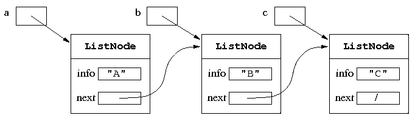
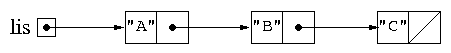
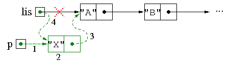
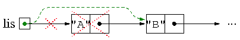
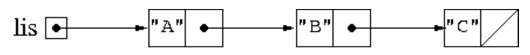
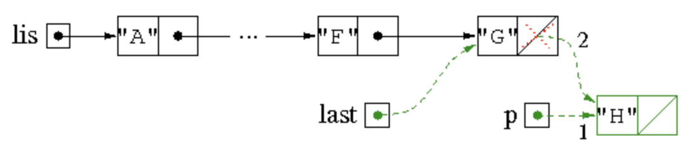
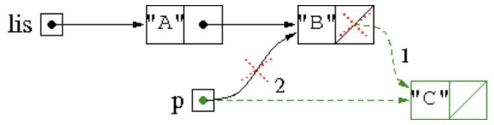
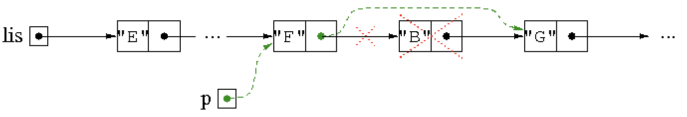
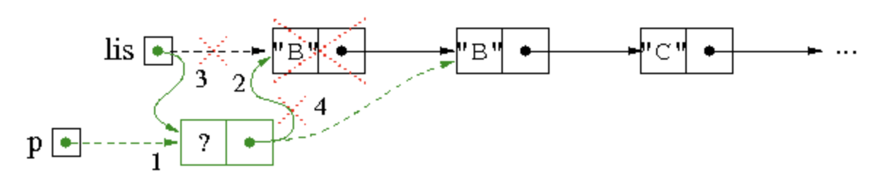
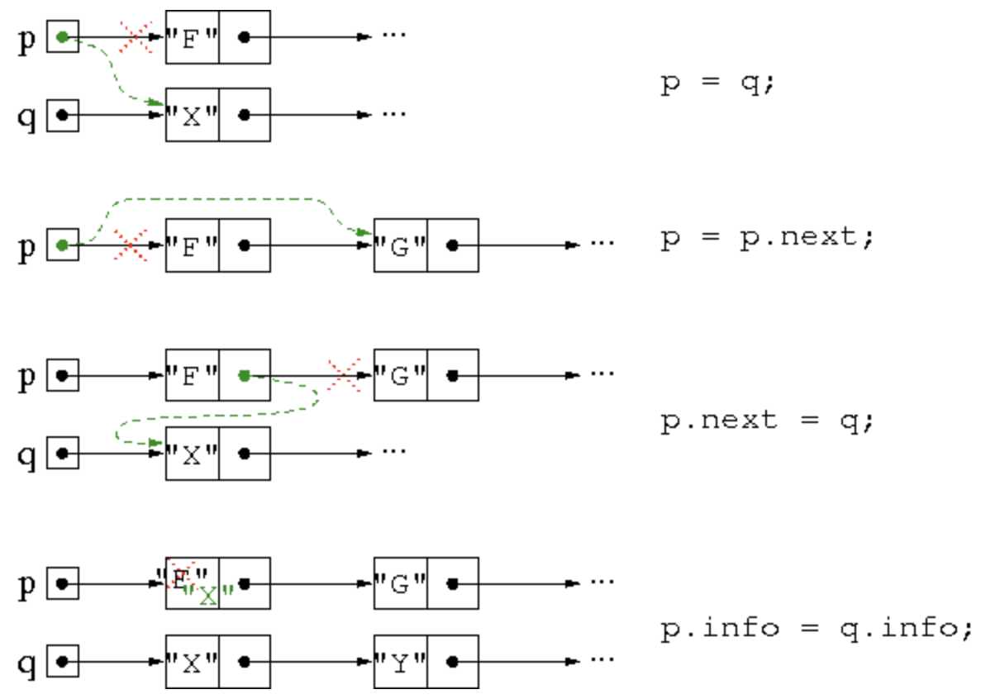

# Dynamic arrays and linked lists

## Summary

- Limitations of arrays
- Dynamic memory management
- Definitions of lists
- Typical operations on lists: iterative implementation
- Typical operations on lists: recursive implementation

## 배열의 제한사항 (Limitations of arrays)

- 동일한 Data type에 대한 객체/값을 저장할 때, 배열을 주로 사용하지만 Java에서 처리되는 배열의 방식에 존재하는 몇 가지 제한사항이 존재한다.

- 배열의 차원은 배열이 생성되는 순간에 결정되며, 추후에 변경이 불가능합니다.
- 배열은 실제로 관심있는 요소의 수와 관계없이 크기에 비례하는 메모리 양을 차지합니다.
  - int 형 배열 length 100의 크기 != 100 Byte, int 형 배열 length 100의 크기 == int형의 크기 4 Byte \* 100
- 배열의 요소를 입력된 순서대로 유지하고 있으며, 그러한 요소의 위치에 새 값을 삽입하거나 요소를 제거하려면 각 요소들을 이동 해야한다.
  - 위의 방식은 매우 비효율적인 방식이다.

## 배열의 차원 처리하기 (Dealing with the dimension of an array)

- 배열의 제한 사항 중 일부는 필요에 따라, Runtime에 동적으로 할당 및 할당 해제되는 방식으로 극복할 수 있다.

배열의 크기를 동적으로 관리하는 Person 타입의 배열을 관리하는 클래스입니다.

```java
public class ListOfPersonsArray {

  private Person[] a;
  private int n;

  public ListOfPersonsArray() {
    a = new Person[10];
    n = 0;
  }

  // Add a person to the List of Persons in the last position
  public void add (Person p) {
    if (n == a.length) {
      // The array is full!!!
      // We have to create a new, bigger array and copy all elements
      Person[] b = new Person[a.length*2];
      for (int i=0; i<a.length; i++)
        b[i] = a[i];
      a = b;
    }
    // Now we are sure that n < a.length
    a[n] = p;
    n++;
  }

  // Remove the person in position k
  public void remove (int k) {
    if ((k >= 0) && (k < n)) {
      // We have to move all elements that follow k
      for (int i = k; i < n; i++)
        a[i] = a[i+1];
      n--;
    }
    // We reduce the dimension of the array if it is sufficiently empty
    if ((a.length > 10) && (n < a.length/4)) {
      Person[] b = new Person[a.length/2];
      for (int i = 0; i < n; i++)
        b[i] = a[i];
      a = b;
    }
  }
}
```

배열 동적 관리는 해당 차원을 동적으로 변경하는 방식이 아니라 사용자의 요구에 따라 더 크거나 작은 배열을 생성한다. <br>
이러한 배열이 변경될 때마다 모든 값을 새로운 배열에 복사하는 방식으로 수행됩니다. <br>

동적으로 생성된 새 배열의 차원(Size)은 새로운 요소가 필요할 때는 2배로 증가하고 배열이 충분히 비어있다면 절반으로 줄어듭니다. <br>
위의 예제에서는 배열의 길이 / 4 보다 작다면 크기가 더 작은 배열을 생성해서 값을 복사한 다음에 그 배열의 주소를 해당 변수에 할당합니다. <br>

## 동적 메모리 관리 (Dynamic memory management)

- 배열을 사용할 때, 메모리 자원을 할당하고 사용하지 않을 때, 메모리 할당을 해제하는 방법을 사용한다.
- App에 필요한 Data를 저장하기 위해 기계(H/W) 메모리와 상호 작용하는 방식을 정의하기 때문에 동적 메모리를 관리하는 것이 중요합니다.

- 객체 컬랙션을 정의하고 조작하기 위해서 메모리를 동적으로 할당하는 추가적인 메카니즘을 구현하기 위해 Linked List가 필요하다.
- Linked List는 요구사항에 따라서 메모리를 동적으로 할당하고 할당 해제할 수 있는 방식으로 정확하게 정의됩니다.

_List가 제공하는 동적인 메모리 처리와 다르게 Array의 경우에는 생성되면 크기를 변경할 수 없기 때문에 정적 메모리를 관리한다고 할 수 있다._

## 연결 리스트(Linked lists)

- 동적 메모리 관리를 위한 메커니즘은 연결된 구조(Linked Structure)에 기초하여 제공되며 특정한 위치에 있는 값을 쉽게 삽입 및 수정할 수 있습니다.

- 시퀀스(Sequence)가 선형이라는 의미는 각 요소에 대하여 최대 1개의 후속 요소가 있다는 것을 뜻합니다.

  - 마지막 요소인 경우에는 후속 요소가 없을 수도 있습니다.

- 일반적으로 List의 목록의 개수는 미리 알 수 없으며, 모든 노드에 대한 참조를 포함하는 변수가 없습니다. 그 대신에 우리는 첫 번째 노드에대한 참조만 유지하고 링크를 따라서 후속 노드의 참조(메모리 주소값)을/를 알 수 있습니다.
  - 비어있지 않은 List의 첫 번째 Node의 참조(메모리 주소값)로 표현됩니다.
  - 비어있는 List는 `null`로 표현됩니다.

## Node 클래스 (The class ListNode)

- Linked List의 기본적인 구조는 1개의 객체로 관련된 정보를 표현하는 것 입니다.

```java
public class ListNode {
  public ElementType info;
  public ListNode next;
}
```

- 해당 클래스는 2개의 인스턴스 변수(Instance Variables)를 선언하였습니다.

  - info - 특정한 타입의 관심 정보를 포함합니다.
  - next - 목록의 다음 노드에 대한 참조를 포함합니다.

- 해당 인스턴스 변수에 직접 접근하기를 원하는 경우, `private`으로 선언하는 것이 아닌 `public`으로 선언합니다.
  - 이러한 경우에는 각 변수에 접근하기 위한 메서드(Selector/Modifier) 등이 필요없습니다.

## nodes 생성 및 연결 (Creation and linking of nodes)

```java
class ListNode {
  String info;
  ListNode next;
}

public class TestList {
  public static ListNode create3NodesABC() {
    ListNode a = new ListNode();
    ListNode b = new ListNode();
    ListNode c = new ListNode();
    a.info = "A";
    a.next = b;
    b.info = "B";
    b.next = c;
    c.info = "C";
    c.next = null;
    return a;
  }
}
```

위의 코드는 3개의 노드를 가지고 있는 선형적인 구조를 생성하는 코드입니다. <br>
다음의 사진은 위의 방법으로 생성된 List의 메모리 표현입니다.



## Linked List에 대한 Operation (ADT?)



이렇게 생성된 Linked List 타입의 변수 `lis`에 첫 번째 node에 대한 참조가 포함되어 있다. <br>
lis에서 우리가 구현해야할 동작(Method)들은 다음과 같습니다.

- List가 비어있는지 확인하는 동작
- node를 수정하고나 그 안에 존재하는 값에 접근하는 동작
- List에 존재하는 모든 요소에 접근하여 순회하는 동작
- 목록의 크기를 지정할 수 있는 동작
- 특정한 요소 및 위치에 접근하여 값을 삽입하거나 수정하는 동작
- 입력 스트림에서 각 요소들을 읽어서 List를 반환하는 동작
- List를 배열이난 문자열로 반환하는 동작

이러한 동작의 매개변수는 List의 첫 번째 노드(node)에 대한 참조를 매개변수의 하나로 사용합니다. <br>
동작(Method)이 List를 수정하는 경우, 수정된 목록의 첫 번째 노드(node)에 대한 참조(메모리 주소값)를 반환 값으로 사용합니다.

## 신규 요소를 List의 첫 번째 요소로 삽입 (Inserting a new element as the first one of a list)

1. 요소에 대한 새로운 노드를 생성합니다.
2. 노드에 요소에 관한 정보를 할당합니다.
3. 새로운 노드를 원래 List와 연결합니다.
4. 새롭게 생성된 노드를 List의 첫 번째 노드로 만듭니다.

```java
public static ListNode insertFirst(ListNode lis, String s) {
  ListNode p = new ListNode();     // 1
  p.info = s;                      // 2
  p.next = lis;                    // 3
  lis = p;                         // 4
  return lis;
}
```



## List의 첫 번째 요소를 삭제 (Deleting the first element of a list)

- 일반적으로 List의 요소를 삭제한다는 것은 삭제할 노드의 연결을 다른 노드와 끊고 해당 노드가 후속 노드와 연결이 되지않게 하도록 수정하는 것을 의미합니다.

1. List가 비어있으면 아무것도 하지 않습니다.
2. List에 노드가 존재하면 목록 변수의 값에 첫 번째 node의 후속 node의 참조(메모리 주소값)를 할당합니다.

```java
public static ListNode deleteFirst(ListNode lis) {
  if (lis != null)
    lis = lis.next;
  return lis;
}
```



## List의 연속적인 노드에 접근하기 (Accessing successive nodes of a list)

- 목록의 모든 요소(노드)에 접근하려면 첫 번째 요소(노드)부터 마지막 요소(노드) 까지 도달해야 합니다.
- 이를 구현하기 위한 방법 중 하나는 반복을 이용하는 것 입니다.

```java
ListNode lis = ...
ListNode p = lis;
while (p != null) {
  process the node referenced by p
  p = p.next;
}
```

변수 p를 현재 노드에 대한 참조로 사용하여 List를 scan한다는 점을 유의해야 한다. <br>
p를 List의 첫 번째 노드의 메모리 주소값로 초기화 한 다음에 반복문에서 반복이 진행 되면서 `p = p.next`를 통해서 다음 노드로 이동한다. <br>
이 구문은 List를 순회하는 것이지 수정하는 것은 아니다.

## `PrintStream`에 List 요소 출력 (Printing the elements of a list on an output stream)

```java
public static void print(ListNode lis, PrintStream ps) {
  ListNode p = lis;
  while (p != null) {
    ps.print(p.info + " ");
    p = p.next;
  }
  ps.println();
}
```



반복문을 통해서 List의 요소에 접근하는 것은 동일하다. <br>
그러나 `PrintStream`을 사용해 출력하는 것에서 차이점이 존재한다.

## List의 귀납적 구조 (Lists as inductive structures)

- List의 모든 요소들이 Inductive한 방법으로 생성/호출된다는 사실로 활용한다.

  1. 비어있는 List가 존재하면 노드(node)를 추가한다. / 함수를 종료한다.
  2. List가 비어있지 않는다면, 노드(node)에 접근하여 후속 노드에 접근할 수 있습니다.

- Pseudocode

```
if (the list is empty) {
perform the operation for the empty list
} else {
perform the operation on the first element of the list
call the method recursively on the rest of the list
}
```

## List의 요소에 연속적으로 접근하기 - 자기호출 사용 (Printing the elements of a list - recursive version)

- List의 요소에 접근하여 출력하는 작업(동작)을 Recursion을 사용하여 구현할 수 있습니다.

1. List가 비어있다면 작업/동작을 중단한다.
2. List가 비어있지 않다면 첫 번째 요소에 접근한 후, List의 나머지 부분을 Recursion으로 접근한다.

```java
public static void print(ListNode lis, PrintStream ps) {
  if (lis == null)
    ps.println();                 // base case
  else {
    ps.print(lis.info + " ");     // process the first element
    print(lis.next, ps);          // recursive call
  }
}
```

## List에 존재하는 요소 검색 (Searching an element in a list)

- List에 찾고싶은 노드/요소가 있는지 확인하려면 다음이 될 때까지 List를 순회한다.
  - 찾고싶은 노드를 발견하여 반환한다.
  - List의 끝 까지 순회한다. (검색 실패)

1. List가 비어있다면 `false`를 반환합니다.
2. 찾고자 하는 노드가 첫 번째 노드였다면 `true`를 반환합니다.
3. 그렇지 않다면 후속 노드들을 순회한 후, 검색한 결과를 반환합니다.

```java
public static boolean search(ListNode lis, String s) {
  while (lis != null) {
    if (lis.info.equals(s)) return true;
    lis = lis.next;
  }
  return false;
}
```

## List에 마지막에 요소를 삽입 (Inserting a new element as the last one of a list)

1. List가 비어있다면 신규 노드를 만들고 반환한다.
2. List가 비어있지 않다면, 현재 참조가 마지막을 가르킬 때 까지 순회한 후, 신규 노드를 생성하고 마지막 노드와 연결한다.

```java
create a new node whose info field is elem;
if (lis is empty)
  return the list constituted only by the new node;
else {
  scan the list stopping when the current reference points to the last node
  concatenate the new node with the last one
}
```

```java
  public static ListNode insertLast(ListNode lis, String s) {
    ListNode p = new ListNode();      // note: p.next == null
    p.info = s;

    if (lis == null)
      return p;                       // the list contains only the new node
    else {
      ListNode last = lis;
      while (last.next != null)       // find last element
        last = last.next;
      last.next = p;
      return lis;
    }
  }
```



## List의 마지막에 삽입 - Recursion

1. List가 비어있다면 1개의 신규 노드를 생성하고 반환합니다.
2. List가 비어있지 않다면, Recursive 함수를 호출하여 마지막 노드까지 이동합니다. 마지막 노드의 후속 노드는 존재하지 않으므로 1번의 경우가 실행됩니다.

```java
public static ListNode insertLast(ListNode lis, String s) {
  if (lis == null) {
    ListNode res = new ListNode();    // note: res.next == null
    res.info = s;
    return res;
  } else {
    lis.next = insertLast(lis.next, s);
    return lis;
  }
}
```

## 파일에서 정보를 읽어와 List 생성 (Creation of a list whose elements are read from a file)

파일에서 정보를 읽어, List를 구성하면서 마지막에 새로운 노드를 추가하는 상황이다.



- 반복적인 수행이 가능하도록 첫 번째 요소를 처리할 필요가 없는 generator node 기술을 사용합니다.
  - generator node는 필드에 중요한 정보가 존재하지 않는(비어있는?) 노드입니다.

1. List의 각 요소를 받을 생성기 노드를 선언한다, 이러면 모든 노드는 선행노드에서 부터 동일한 방식으로 처리가 가능하다.
2. 생성기 노드에 후속 노드의 참조를 반복적으로 할당하며, 각 노드의 내부 정보에 접근한다.
3. 동작을 종료하기 전에 생성기 노드를 할당 해제/제거 해주어야 한다.

```java
public static ListNode read(BufferedReader br) throws IOException {
  // note: the value EOF (^D) in input terminates the insertion
  ListNode lis = new ListNode();    // create generator node
  ListNode p = lis;

  String s = br.readLine();
  while (s != null) {
    p.next = new ListNode();        // note: p.next.next == null
    p = p.next;
    p.info = s;
    s = br.readLine();
  }

  lis = lis.next;                   // delete generator node
  return lis;
}
```

## List에서 첫 번째 항목을 삭제 (Deleting the first occurrence of an element from a list)

- 반복을 이용해서 List의 첫 번째 요소를 삭제하려면 다음의 과정을 실행하시오.
  1. 삭제하고자 하는 노드를 검색해야함.
     1-1. 삭제하고자 하는 노드(타겟)이 없다면 아무 작업도 수행되지 않는다.
     1-2. 타겟이 List에 존재한다면 3개의 경우로 나눌 수 있다.
  2. 타겟이 List의 첫 번째 노드일 경우, 두 번째 노드에 대한 참조를 반환합니다.
  3. 타겟이 List의 중간에 위치한 노드일 경우, 타겟의 선행 노드의 참조와 후속 노드의 참조를 업데이트 합니다.
  4. 타겟이 List의 마지막 노드에 위치할 경우, 선행 노드의 참조를 `null`로 할당합니다.

```java
public static ListNode delete(ListNode lis, String s) {
  ListNode p = new ListNode();    // create the generator node
  p.next = lis;
  lis = p;

  boolean found = false;
  while ((p.next != null) && !found) {
    if (p.next.info.equals(s)) {
      p.next = p.next.next;       // delete the element
      found = true;               // forces exit of the loop
    } else
      p = p.next;
  }

  return lis.next;                // delete generator node
}
```



## List 전체 삭제 (Deleting all occurrences of an element from a list)

- List의 전체 노드들을 삭제하려면, 첫 번째 항목의 삭제를 응용하여 구현 할 수 있다.
  - 첫 번째 노드를 삭제하는 것과의 차이점
    1. 노드를 찾아서 삭제한 후, List를 계속 탐색해야함.
    2. List의 끝에 도달한 경우에만 중지합니다.

```java
public static ListNode deleteAll(ListNode lis, String s) {
  ListNode p = new ListNode();    // create the generator node
  p.next = lis;
  lis = p;

  while (p.next != null) {
    if (p.next.info.equals(s))
      p.next = p.next.next;       // delete the element
    else
      p = p.next;
  }

  return lis.next;                // delete generator node
}
```



## List 전체 삭제 - Recursion 사용

1. List가 비어있다면 비어있는 List를 반환
2. List의 첫 번째 노드가 타겟 이라면, List의 모든 항목을 삭제한 후, 해당 List를 반환
3. 타겟이 첫 번째가 아니라면, 순회를 거쳐서 일치하는 노드를 찾은 후 2번의 경우와 같이 처리한다.

```java
public static ListNode deleteAll(ListNode lis, String s) {
  if (lis == null)
    return null;
  else if (lis.info.equals(s))
    return deleteAll(lis.next, s);
  else {
    lis.next = deleteAll(lis.next, s);
    return lis;
  }
}
```

## List 조작의 그래프 표현 요약 (Summary of the graphical representation of list manipulation statements)


