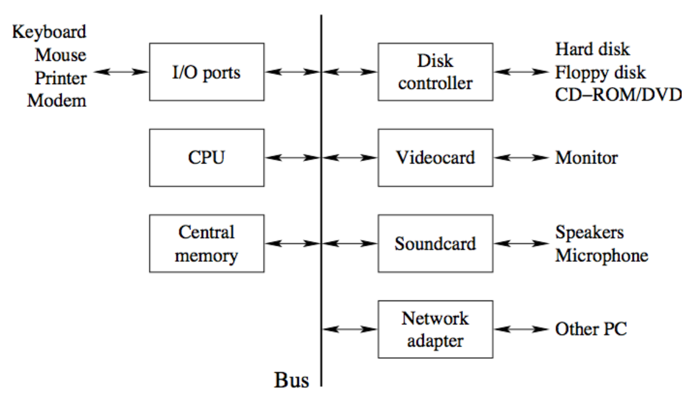
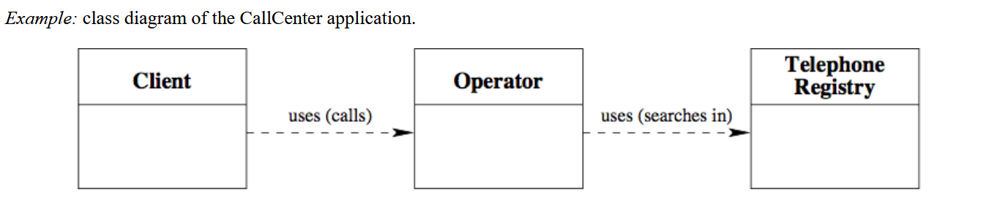
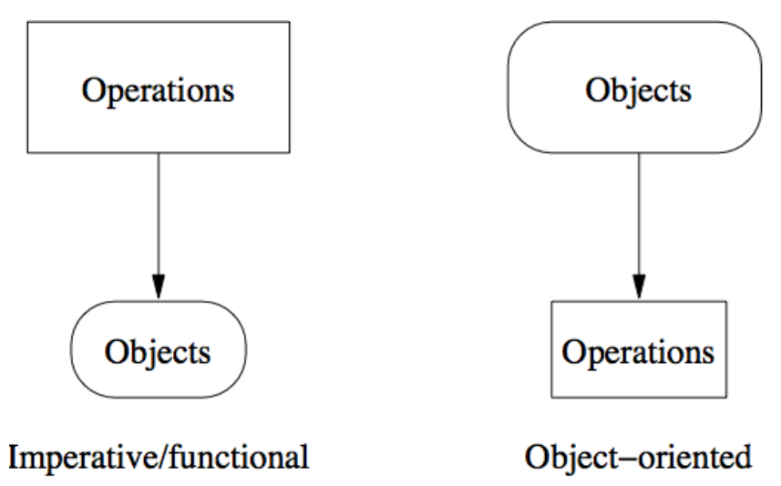
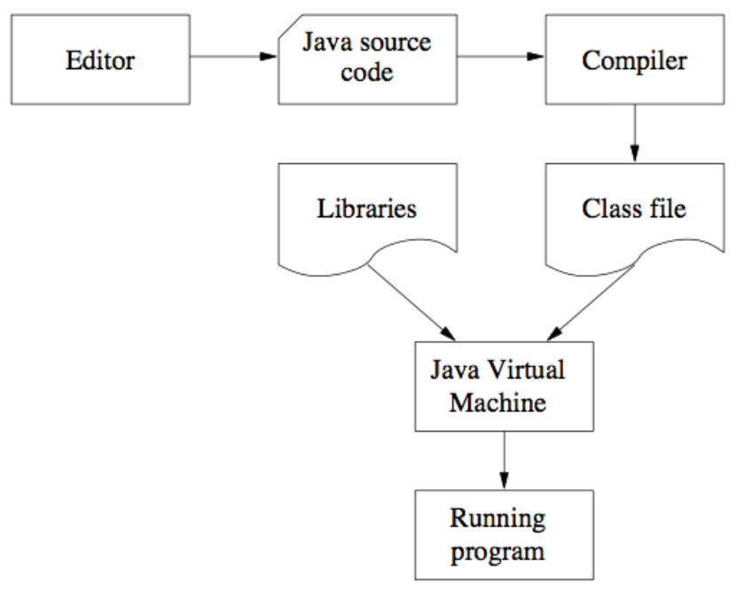
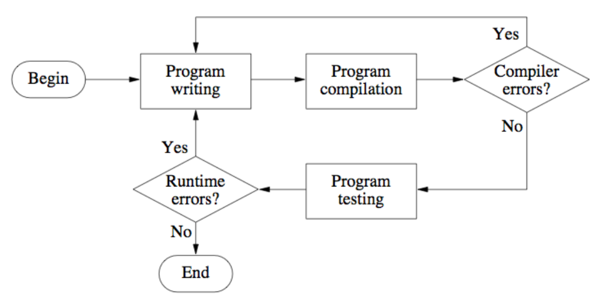

# Introduction to Programming (with Java)

## Summary

- Architecture of a computer
- Programming languages
- Program = objects + operations
- First Java program
- Writing, compiling, and executing a program
- Program errors

## What is Computer?

- 매우 간단한 이진수의 연산(Binary Operation) 수행
- 매우 빠르게 진행
- H/W + S/W

  - Hardware (H/W)

    - 물리적인 구성요소들 / 기계장치

  - Software (S/W)

    - 물리적 구성요소들이 계산을 수행하는 목표를 기술함

## Simplified architecture of a computer

- 사진처럼, 1개의 System Bus로 각 Component에 Data 접근
  - 맨 처음에 I/O ports로 Data를 입력받아서 처리함.
  - 단방향 통신으로 특정 순간에 1개의 Data만 처리가능

## Languages for programming a computer

- Machine Language

  - 컴퓨터가 별도의 해석을 거치지 않고 직접 읽을 수 있는 언어

- Assembler Language

  - 간단한 단어들의 조합으로 연산을 표현할 수 있음.
  - 기계어와 1:1 대응을 이룸

- High Level Language
  - 사람이 쉽게 이해할 수 있게 작성된 프로그래밍 언어

컴퓨터는 Machine Language 밖에 읽지 못함, 따라서 개발자가 High Level Language로 작성한 코드를 Assembler Language로 변환, 1:1 대응을 가지는 Machine Language으로 변환하는 과정을 수행하여야 한다.

사람이 쉽게 이해할 수 있는 언어: High Level Language  
사람이 이해 : 기계의 읽기 = 1 : 1, 이 성립하게 하는 언어: Assembler Language  
기계가 읽을 수 있는 언어: Machine Language

High Level Language → Assembler Language, 변환과정을 우리는 컴파일(Compile)이라고 함.
Assembler Language → Machine Language, 변환과정을 어셈블리(Assembly)라고 함.
이 2개를 묶어서 컴파일, 빌드 과정이라고 함.

## 프로그램(Program)

- 컴퓨터가 실제로 무슨 작업을 수행하는 지를 기술하는 것
- 프로그램은 2가지의 기능적인 부분으로 나뉘어짐
  1. 구현하고자 하는 관심영역과 관련된 Data인 객체(Object)
  2. 의도된 기능을 수행하기 위해 Data를 조작하는 방법의 기술, 작업(Operation)

## Objects: 관련된 정보를 대표

- 동일한 Object들 일반화, 새로운 타입으로 정의 Class
- 타입 간, 관계를 식별하여 객체 간의 상호연결을 구성할 수 있음.
  - Class diagram을 그려서 파악이 가능함.
    
- 각 타입에 속하는 속성(객체변수)들을 구성할 수 있음.
- 이러한 타입(클래스)을/를 각 프로그래밍 언어로 구현할 수 있음.

## Algorihithms: 동작/작업의 구현

- 문제를 해결하기 위한 명령어들의 절차/집합

- 알고리즘의 특징
  1. 명확성: 임의의 사람도 해당 알고리즘을 이해 가능해야함.
  2. 실행 가능성: 알고리즘이 제한된 시간동안 실행이 되어야함.
  3. 유한성: 유한한 시간내에 종료 되어야함.

## Programming paradigms

1. 순차적 (Imperative): 작성한 명령어의 순서대로 동작
2. 절차적 (Functional): 작성된 함수의 입출력에 따라 값을 변경하면서 동작
3. 객체지향적 (Object oriented): 객체 간, 관계에 대한 연산을 통해 객체의 상태를 변화시켜가며 동작을 수행

## Java

- High Level Language
- 객체 지향 언어 (Imperative, Functional paradigm 지원)

 

- 단순하다 (함수/메서드의 연속으로 프로그램을 개발 가능)
- OS에 독립적으로 실행이 가능하다.
- 풍부한 API 라이브러리를 가지고 있다.
- Internet에서의 사용을 고려하여 설계되었다.
- VM 기반으로 실행된다.
- VM이 인터넷을 통한 불필요한 접근을 차단하여 보다 안전하다.

 

- {파일}.java → {클래스}.class(바이트 코드) → JVM에서 실행
- 1개 자바 소스에 여러개의 클래스가 존재한다면
  - 다수의 클래스 파일이 생성됨. (1개 자바 → 다수 클래스)

## Errors (Unit 9에서 자세하게 설명)

- Syntax Error (문법적 오류): Java의 문법을 준수하지 않아서 발생하는 오류
- Semantic Error (의미적 오류): 불가능한 Assignment 등 부적절한 Statement를 작성할 경우 발생하는 오류
- Logical Error (논리적 오류): 예상하는 기능의 결과와 실제 수행 결과가 불일치 할 경우 발생하는 오류

## Java 작성-컴파일 DFD

