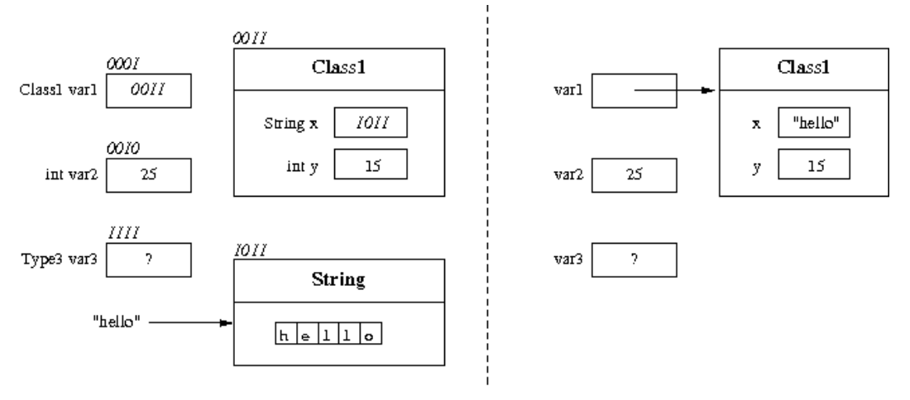
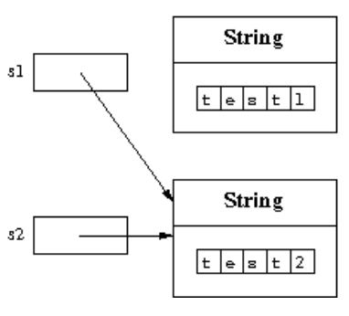
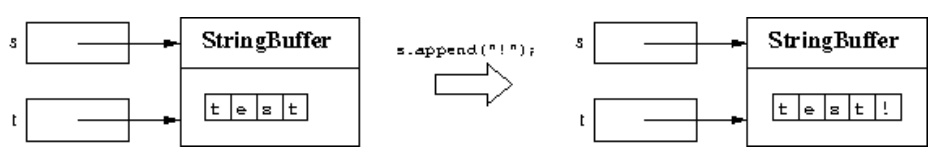

# Use of objects and variables

## Summary

- Objects and classes
- The class String
- Method invocation
- Variables
- Assignment
- References to objects
- Creation of objects: invocation of constructors
- Immutable and mutable objects
- The class StringBuffer
- Input from keyboard

## A simple Java program

```java
public class MyMessage {
  public static void main(String[] args) {
    //What does this program do?
    /* Do you know it?
       It's easy. */
    System.out.println("JA");
    System.out.println("VA");
  }
}
```

- 프로그램의 형태

  - 1개의 단어를 구분할 때에는 공백문자를 사용함.
  - 새로운 줄에 작성하는 것은 2개의 공백문자로 표현한다.
  - 공백 문자의 개수로 새로운 줄에 작성하는 지 1칸을 띄는지 구분

_각 코드의 블록마다 공백문자로 구분하는 것은 프로그램 실행에는 영향을 주지 않으나, 개발자의 가독성을 향상시키는데 영향을 준다._

- 주석 (Comment)

  - 프로그램을 기술할 수 있는 단락
  - 컴파일 되지않는다.
    - 1줄 주석 (// ...)
    - 여러 줄 주석 (/⋇ ... ⋇/)

- Java의 다른 항목
  - Java의 모든 변수/함수 등은 클래스 내부에 선언되어야한다.
  - 프로그램이 시작되면 `public static void main(String[] args)` 함수가 제일 먼저 실행된다.
  - System은 Java에서 미리 정의한 클래스이다.
  - System.out은 미리 정의된 PrintStream 클래스의 Object/Instance 이다.
  - `println(...)`은 System.out의 메서드이다.

_Java는 클래스의 경우 첫 글자를 대문자로, 메서드/함수의 경우는 첫 글자를 소문자로 작성하는 것이 관례이다. 이러한 관례를 존중하는 것이 Java를 이해하는 데 도움을 줄 수 있다._

## `print( ... )` 와 `println( ... )`의 차이점

- `print( ... )`

  - paramter로 들어온 문자열(String)을 화면에 출력

- `println( ... )`
  - paramter로 들어온 문자열(String)을 화면에 출력 + 커서(cursor)를 다음 줄로 이동

## Objects and classes in Java

- Object: 프로그램 내에서 조작되는 존재
- Class: 공통의 속성과 동작을 가지고 있는 Object를 일반화하여 1개의 타입으로 정의한 것
- Instance: Object는 특정 시점에 값을 가지는 1개의 Class로 볼 수 있어, Class의 Instance라고 할 수 있음.
- 클래스에 존재하는 메서드만이 Object가 Call 할 수 있음.

```java
System.out.print(); //OK
System.out.foo();   //ERROR
```

## String class

- Java에서 미리 정의한 class
- String 클래스의 객체/상태를 정의하여 문자열을 표현할 수 있음.
- 코드에서 쌍 따옴표("")로 String을 표현할 수 있음
  - 코드에서 직접적으로 표현한 String은 String Literal이라고 함.

_new 키워드를 사용하여 생성된 객체랑 Literal은 저장되는 공간이 다르다._

| Return type | Method                                    | 동작 설명                                                                                   |
| :---------: | :---------------------------------------- | :------------------------------------------------------------------------------------------ |
|   String    | s.concat(String str)                      | 문자열 s에 parameter로 넘겨준 문자열을 더한 문자열을 반환                                   |
|     int     | s.length()                                | 문자열 s의 길이(전체 크기)를 반환                                                           |
|   String    | s.substring(int beginIndex)               | 문자열 s의 주어진 인덱스(beginIndex) 부터 끝까지의 부분 문자열을 반환                       |
|   String    | s.substring(int beginIndex, int endIndex) | 문자열 s의 첫 번째로 주어진 인덱스 부터 두 번째로 주어진 인덱스 전까지의 부분 문자열을 반환 |
|   String    | s.toLowerCase()                           | 문자열 s를 소문자로만 변환된 형태로 변환한 문자열을 반환                                    |
|   String    | s.toUpperCase()                           | 문자열 s를 대문자로만 변환된 형태로 변환한 문자열을 반환                                    |
|   String    | s.trim()                                  | 문자열 s 앞, 뒤에 존재하는 공백문자를 제거한 문자열을 반환                                  |

## Method signature and method header

- 메서드 시그니처 (Method signature/Type signature)
  - 메서드의 이름, parameter에 대한 설명으로 구성
    (i.e., type, number, and position)
  - Access Modifiers, Binding Quantifier 등은 Type signiture에 포함되지 않는다.

_매개변수의 이름은 Type signature에 관련이 없습니다._

- 메서드 헤더 (Method header)

  - 메서드 시그니처(Method signature) + Return type

- void 타입

  - 어떠한 값을 return하지 않고 block내 주어진 statement만 수행함.

## Static methods

- static이라는 바인딩 한정자(Binding Quantifier)가 붙은 메서드는 객체에 관계없이 바로 호출될 수 있다.
  - 객체에 소속되는 것이아닌 클래스에 소속되어 모든 객체가 공통적인 동일한 동작을 수행함.
  - "static"은 그 뜻 자체로 객체가 생성되는 시점에 해당 메서드가 생성되는 것이 아니라 코드를 컴파일하는 시점에 생성된 메서드이다.
    - 객체가 생성되는 시점 → 런타임(Runtime) 실행 시간(Excute time)
      - 만들어진 클래스 파일을 JVM에서 동작 시키는 시점
    - 코드가 컴파일되는 시점 → 컴파일 타임(Compilation? time/Compile time)
      - 작성된 소스파일을 바이트 파일로 만드는 시점

_객체에 속해있지 않아서, 객체의 상태를 변화시키는 동작이라는 뜻의 메서드는 의미상 맞지않아 함수라는 다른 이름으로도 불린다._

## 변수 (Variables)

_변수는 객체에 대한 참조를 저장하는데 사용되는 메모리의 위치를 표현_

- 변수의 주요한 성질
  - 이름: 변수를 식별하는데 사용됨.
  - Type: 변수가 표현하고자하는 Data Type을 나타냄
    - 이진수를 어떠한 방식으로 표현하는지에 따라 다른 값으로 표현이 가능함.
  - 주소: 저장된 Data가 메모리 상 어느곳에 있는지를 표현
  - 값: 특정 시점에 표현하는 Data

_프로그램 실행중에 이름, 타입, 주소는 변하지 않고 값만 변한다._

## Assignment VS Initialization

- Assignment: 이미 값이 있는 변수/객체에 값을 지정
- Initialization: 값이 없는 변수/객체에 초기값을 지정

_Initialization은 단 한번만 시행됨, Assignment는 여러번 시행될 수 있다._

## Graphical notation for representing variables



## Use of "+" for string concanenation

- String 클래스의 메서드인 `concat()`이 '+'로 대치하되 사용된다.

```java
public class JFK {
  public static void main(String[] args) {
    String  first = "John";
    String  middle = "Fitzgerald";
    String  last = "Kennedy";
    String  initials;
    String  firstInit, middleInit, lastInit;
    firstInit = first.substring(0,1);
    middleInit = middle.substring(0,1);
    lastInit = last.substring(0,1);
    initials = firstInit + middleInit + lastInit;
    System.out.println(initials);
  }
}

// or simply
public class JFK2 {
  public static void main(String[] args) {
    String  first = "John";
    String  middle = "Fitzgerald";
    String  last = "Kennedy";
    System.out.println(first.substring(0,1) +
                       middle.substring(0,1) +
                       last.substring(0,1));
  }
}
```

## Empty string

```java
String str = new String()
```

```java
String str = "";
```

- 이렇게 2가지의 방법으로 비어있는 문자열을 표현할 수 있음.

## Accessibility of objects

- 같은 유형(Type)의 객체/변수는 서로의 값을 저장할 수 있다.

```java
String s1 = new String ("test1");
String s2 = new String ("test2");
s1 = s2;
```



- 어떠한 참조도 없는 객체는 Java의 Garbage Collecter가 수거하여 비어있는 메모리 공간으로 만들어 준다.

## Immutable objects VS Mutable objects

- Immutable objects

  - 저장된 상태를 변경할 수 없는 객체
  - 해당 객체의 값을 변경하기 위해서는 새로운 객체를 만들어 변수에 Assign하는 방법밖에 없다.

- Mutable objects
  - 저장된 상태를 변경할 수 있는 객체
  - 메서드가 동작하면서 Side-Effect를 발생시킬 수 있음.
    - 개발자가 예상하지 못한 결과 혹은 작용

```java
public class SideEffect1 {
  public static void main (String[] args) {
    StringBuffer s = new StringBuffer("test");
    StringBuffer t;
    t = s;
    s.append("!");
    System.out.println(s.toString());
    System.out.println(t.toString());
  }
}
```



_2개의 변수(t, s)가 가르키는(참조하는) 객체가 동일하여, 발생한 Side-Effect_
