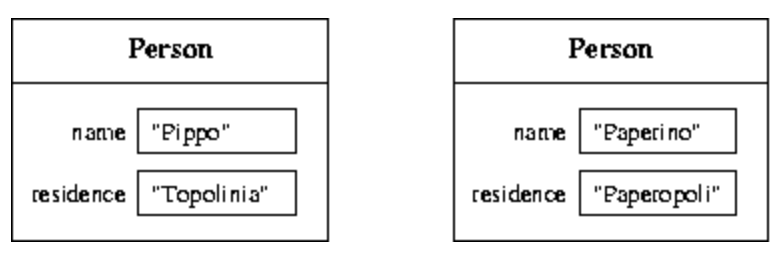

# Definitions of methods and classes

## Summary

- Modularization
- Abstraction on operations
- Definition of methods
- Parameter passing
- Execution of a method
- Variables declared inside a method: scope and lifetime
- Abstraction on objects
- Definition of classes
- Access control
- Instance variables
- Methods
- Constructors
- Design of a class
- Inheritance
- Overriding of methods and polymorphism
- The class Object

## 모듈화 (Modularization)

- 프로그램의 개발이 길고 복잡해짐에 따라, 프로그램의 복잡도를 관리하기 위해 프로그램을 모듈화하여 구현한다.

  - 프로그램은 자동화된 부분들로 구성되는데, 이러한 자동화된 부분을 모듈이라고 한다.(Module)
  - 프로그램을 구성하는 다양한 모듈들은 명확한 관계로 상호 연관되어 있습니다.

- 모듈의 특성

  - 특정 모듈이 다른 모듈이 요청하는(원하는) 기능을 수행할 수 있습니다.
  - 모듈의 실행 결과를 다른 모듈의 입력으로 전달함으로 모듈 간 인터페이스의 역할을 수행합니다.
    - 인터페이스 (Interface): 상호간의 다른 시스템에서의 통신 규격
  - 특정 모듈이 다른 모듈을 실행을 요청하는 클라이언트(Client)로서 동작합니다.
  - 외부에서 모듈의 동작(구현) 방식을 알 수 없습니다.

- 기존 프로그램을 모듈화 하는 순서/과정
  1. 문제를 해결하는데 필요한 기능이 무엇인지 정의합니다.
     - 이렇게 정의된 기능은 1개의 모듈로서 구현 됩니다.
  2. 각 기능이 문제를 해결하는 과정에 어떻게 연결/연관 되어있는지 확인 및 정의 합니다.
  3. 각 기능/모듈을 구현할 때, 다른 모듈에 독립적으로 구현되어야 한다.

_일반적으로 1개의 모듈은 독립적으로 실행이 가능 해야한다._

- 모듈화를 통해서 향상될 수 있는 부분
  1. 가독성 향상
  2. 확장성 향상
     - 프로그램의 기능을 확장 할 때, 다른 모듈/기능을 추가하는 방식으로 프로그램을 확장할 수 있음.
  3. 재사용성 향상
     - 사전에 정의해둔 모듈/기능이 존재할 경우, 프로그램의 확장을 이용해 기존의 모듈을 추가할 수 있음.

## 추상화 (Abstraction)

- 모듈화와 추상화, 이 2개의 작업은 서로 관련이 있는 것처럼 보인다.

  - 추상화를 먼저 진행하고, 모듈화를 위한 과정을 진행한다?

- 문제를 해결하기 위해서 문제의 본질을 파악하고 문제 해결을 위한 해결방안을 구성한다.

  - 문제의 본질을 파악하기
  - 달성하고자 하는 목표, 이외의 다른 부분을 과감하게 배제

- 추상화의 유형

  1.  동작에 관한 추상화 (Abstraction on operations)

      - 어떻게 동작을 구현하는지 보다 무엇을(어떠한 동작을) 구현하는 것이 중요하다.
        - Java에서는 메서드(Method)를 통해서 동작/연산을 추상화할 수 있다.
          - 메서드 (Method): 객체(Object)를 변화시키는 동작
      - 함수 (Function) VS 메서드 (Method)
        - 메서드에는 소유하고 있는 객체가 존재하므로 어떠한 기능이 객체에 속해있다면 메서드로 볼 수 있을 것
        - 함수는 소유하고 있는 객체가 없으므로 `static`으로 정의된 메서드를 함수라고 부를 수 있을 것

  2.  객체에 관한 추상화 (Abstraction on objects)

      - 공통된 객체(Object)들을 모아서, 그룹화(일반화) 시킨 것: 클래스(Class)

      - Java에서의 정의

        - Class 자체를 식별하거나 Class에 속하는 객체(상태)의 타입을 Class의 이름으로 식별할 수 있음.
        - 객체/상태 내부에 Data를 저장할 수 있는 변수(Variables)를 인스턴스 변수, Data Field라고 한다.
        - 클래스 타입의 객체에 대하여 객체의 상태(Instance Variables의 값)를 변경할 수 있는 동작/작업을 클래스 메서드(Class Method)라고 한다.

      - 접근 지정자 (Acess Modifier)

        - 클래스에 작성된 메서드/함수를 외부에서 접근(Acess) 할 수 있는지를 지정하는 Keyword

        - 접근 지정자 (Acess Modifier)의 종류

          - Public: 외부에서 접근이 가능
          - Protected: Default + 해당 클래스 타입의 하위 타입이 접근 가능
          - Default: 같은 패키지(Package)에서만 접근이 가능
          - Private: 외부에서 접근 할 수 없음.

      - 클래스 (Class)
        - 클래스 식별자: 클래스의 이름
        - 클래스의 구성요소(필드)
          - Instance: 객체의 내부 구조(객체를 대표하는 속성)을 표현하는데 사용
          - Method: 객체가 수행하는 동작을 구현

```java
public class Person {
  //instance variables (data fields)
  private String name;
  private String residence;

  //methods (operation fields)
  public String getName() {
    return name;
  }
  public String getResidence() {
    return residence;
  }
  public void setResidence(String newResidence) {
    residence = newResidence;
  }
}
```

## 정의된 클래스의 사용법 (Use of a defined class)

```java
public class ClientClassPerson {
  public static void main(String[] args) {
    Person p1;
    p1 = new Person();
    p1.setResidence("Roma");
    System.out.println(p1.getResidence());
  }
}
```

클래스 타입의 변수를 선언하고 변수에 new 키워드를 사용하여 객체를 생성하고 변수를 초기화한다.
객체 변수의 메서드나 변수에 접근하고 싶을 때, 선택 연산자(Selection Operator)를 사용하여 접근이 가능하다. (접근이 가능할 경우)

## Static Method (Function)

- 원칙적으로 클래스 블락(Class Block) 밖에 작성되는 동작을 함수(Function)이라고 부르는데 Java에서는 모든 코드가 Class Block 내부에 작성되므로 함수가 없다. 그러나 메서드의 정의가 객체(Object)의 상태를 변경하는 동작이므로 상태를 변화시킬 객체가 존재하지 않는다면 메서드가 아니라서 함수라고 부를 것이다.

```java
public static void printGreeting() {
  System.out.println("Good morning!");
}
```

```java
public static void printPersonalGreeting(String firstName, String lastName) {
  System.out.print("Good morning ");
  System.out.print(firstName);
  System.out.print(" ");
  System.out.print(lastName);
  System.out.println("!");
}
```

- 반환 (return) keyword

  - return 명령어는 어떠한 값이나 표현식을 메서드/함수가 호출된 구문의 주소로 보내는 것을 뜻합니다.
  - return 뒤에 전송할 표현식(표현식의 결과), 특정한 값 등을 작성하면 된다.

- 매개변수 전달 (parameter passing)
  - 형식 매개변수(Formal Parameter)에 실제 매개변수(Actual Parameter)의 값/메모리 주소값을 전달하여 활성화가 가능하다.
  - 컴파일러가 자동으로 바인딩을 진행한다.

```java
public class Parameters{
  public static void changeValueS (String s) {
    s = s.concat("*");
  }

  public static void changeValueSB (StringBuffer sb) {
    sb.append("*");
  }

  public static void main(String[] args) {
    String a = "Hello";
    StringBuffer b = new StringBuffer("Ciao");

    System.out.println("String a = " + a);
    System.out.println("StringBuffer b = " + b);

    changeValueS(a);
    changeValueSB(b);

    System.out.println("String a = " + a);
    System.out.println("StringBuffer b = " + b);
  }
}
```

## 지역 변수 (Local Variables)

- 메서드/함수의 본문(Body)에 포함되는 변수를 지역 변수라고 할 수 있다.
- 우리는 2가지의 본질적인 측면에 중점을 둔다.

- 범위 (Scope): 정적 개념(Static), 개발자가 작성한 코드에 따라서 달라짐.

  - 선언 지점부터 이를 둘러싸는 블록`{ ... }`의 끝까지가 지역 변수의 범위라고 할 수 있다.
  - Java에서의 변수의 범위는 완전히 정적(Static) 개념으로 프로그램을 실행을 고려하지 않고 구조를 분석하여 결정한다.
  - 이러한 Scope 개념은 컴파일 타임(Compile Time)과 관련이 있습니다.

- 수명 (Lifetime): 동적 개념(Dynamic), 프로그램이 동작하는 방식에 따라서 달라짐.

  - 변수(Variables)가 메모리에 존재/유지하여 프로그램 실행 중에 접근할 수 있는 시간을 말합니다.
  - 지역변수의 범위를 규정하는 메서드/함수를 호출하면 활성화 레코드(Activation Records)가 생성되고 메서드/함수가 종료되면 활성화 레코드도 소멸한다.
    - 이러한 과정에서 지역 변수는 생성되고 소멸한다고 말할 수 있다.
    - 종료된 메서드가 재 호출된다면 이전의 AR과 전혀 관련이 없는 새로운 AR이 생성되기 때문에 지역 변수의 값은 휘발성을 가지고 있다라고 말할 수 있다.

지역 변수의 범위 (Scope)는 메서드/함수 Block`{ ... }`에 한정되어 있어, 변수의 가시성 (Visibility) 이라고 불리기도 함.
아래의 경우는 함수의 body에 사용할 수 없는 지역 변수(Scope에 벗어난 지역변수)를 호출하면서 오류가 발생하였다.

```java
public class Visibility {

  public static String duplicate(String s) {
    String t = s + ", " + s;
    return t;
  }

  public static void print1() {
    System.out.println(a);   //ERROR: a is not defined
  }

  public static void print2() {
    System.out.println(t);   //ERROR: t is not defined
  }

  public static void main(String[] args) {
    String a = "Ciao";
    a = duplicate(a);
    print1();
    print2();
    System.out.println(a);
  }
}
```

## 메서드/함수 오버로딩 (Overloading of methods)

- Java에서는 메서드/함수를 식별할 때, Type Signature로 구분한다.
- 2개 이상의 메서드/함수가 동일한 이름을 가져도 매개변수의 타입과 개수, 위치 등으로 구분이 가능하다.

```java
public class Greetings2 {

  public static void printGreeting() {
    System.out.println("Hello!");
  }

  public static void printGreeting(String name) {
    System.out.println("Hello " + name + "!");
  }
}
```

## 인스턴스(상태) 변수 (Instance Variables)

- 클래스 내부에 정의되지만, 메서드 Body 외부에 정의된 변수를 뜻함.
- 인스턴스 변수는 전체 클래스가 아닌 단일 개체와 연결됩니다. 각 개체에는 고유한 인스턴스 변수가 존재한다.



## 인스턴스 변수의 범위 (Scope of instance variables)

- 인스턴스 변수는 클래스에 선언된 변수이므로 클래스에 정의된 모든 메서드에서 사용할 수 있다.

## 인스턴스 변수의 수명 (Lifetime of instance variables)

- 또한 해당 클래스 타입의 객체/인스턴스가 메모리에 유지될 때 까지 인스턴스 변수를 계속 사용할 수 있다.

## 암시적인 형식 매개변수 `this` (The implicit formal parameter `this`)

```java
public class Person {
  private String name;
  private String residence;

  public String getName() {
    return name;
  }
  public String getResidence() {
    String residence;
       // the local variable masks the instance variable with the same name
    residence = this.residence;
       // this is used to distinguish the instance var from the local var
    return residence;
       // here we are referring to the local variable
  }
  public void setResidence(String residence) {
    this.residence = residence;
       // this is again used to distinguish the instance var from the local var
  }
}
```

- this 매개변수는 객체 자체에 접근할 수 있는 keyword 이다.
- 실제로는 인스턴스 변수나 객체의 메서드를 사용할 때 마다 컴파일러가 자동으로 사용합니다.

## 생성자 (Constructors, Ctors)

- 객체를 적절하게 초기화 하는데에 사용하는 메서드
- Return 타입을 지정하지 않고 바인딩 한정자(Static)을/를 사용할 수 없다.

```java
public class Person {
  ...
  // constructor name-residence
  public Person(String n, String r) {
    name = n;
    residence = r;
  }
  ...
}
```

## 생성자 호출 (Invocation of a constructor)

- 객체를 생성하면 자동으로 초기화를 위해서 생성자를 호출함. (JVM이 호출함)
- new 키워드로 메모리 주소를 할당하고 해당 객체에 대한 메모리 참조를 반환한다.
- 생성자에 매개변수(Actual Parameter)에 입력된 값이 객체의 인스턴스 변수의 값으로 초기화 된다.

## 생성자의 오버로딩 (Overloading of constructors)

- Java의 생성자도 메소드의 일종이므로 오버로딩이 가능하다.
- 매개변수의 개수와 타입에 따라서 Java가 인식하는 메서드가 달라져 가능한 부분이다.
- 어떠한 생성자도 사용하지 않는다면은 JVM이 아무것도 하지 않는 기본 생성자(Standard Constructor)를 자동으로 생성하고 호출한다.
  - 기본 생성자를 사용하는 것 대신에 명시적으로 생성자를 정의하는 것을 추천함.

## 공개 인터페이스 (Public Interface)

- 객체의 인스턴스 변수에 접근하기 위한 메서드 → 공개 인터페이스 (Public Interface)
- Java 에서는 Getter, Setter 라고함.
  - Getter: 객체에서 값을 받아오는 메서드
  - Setter: 객체의 값을 할당하는 메서드

```java
public class Car {
  // representation of the objects
  private String plate;
  private String model;
  private String color;
  private Person owner;

  // constructor
  public Car(String p, String m, String c) {
    ...
  }
  // other pubblic methods
  public String getPlate() {
    ...
  }
  public String getModel() {
    ...
  }
  public String getColor() {
    ...
  }
  public Person getOwner() {
    ...
  }
  public void setColor(String newColor) {
    ...
  }
  public void setOwner(Person newOwner) {
    ...
  }
}
```

_일반적인 프로그래밍 이론에서는 Getter를 Selector, Setter를 Modifier라고 부른다._

## 상속 (Inheritance)/Sub Typing

- 기존의 클래스 타입을 특수화한 타입을 정의할 때, 기존의 클래스를 재사용하여 새로운 클래스를 생성하는 것을 의미한다.
- 하위 타입은 상위 타입의 모든 메서드와 인스턴스 변수들을 사용할 수 있으며(Private이 붙은 변수/메서드 제외), 자체적인 변수나 메서드를 가질 수도 있습니다.

```java
public class Person {
  private String name;
  private String residence;

  public String getName() {
    return name;
  }
  public String getResidence() {
    String residence;
       // the local variable masks the instance variable with the same name
    residence = this.residence;
       // this is used to distinguish the instance var from the local var
    return residence;
       // here we are referring to the local variable
  }
  public void setResidence(String residence) {
    this.residence = residence;
       // this is again used to distinguish the instance var from the local var
  }
}
```

```java
public class Student extends Person {
  private String faculty;

  public Student(...) {   // constructor
    ...
  }

  public String getFaculty() {
    return faculty;
  }
}
```

## 하위 타입(Derived, Sub Type)의 특징

- 하위 타입은 상위 타입의 모든 데이터 필드와 연산 필드에 접근할 수 있다. (단, 상위 타입의 메서드/변수가 private이 아닌 경우에만 가능하다.)
- 상위 타입을 사용할 수 있다면 상위 타입의 모든 필드에 접근 할 수있는 하위 타입도 사용 할 수있다. (암시적인 Casting?)
  - 하위 타입은 상위 타입에대한 호환성을 가지고 있다라고 말할 수 있다.
- 상위 타입의 객체에서는 하위 타입이 자제적으로 정의한 메서드/변수에 접근이 불가능 하다. (처음의 문장의 역을 성립하지 않는다.)

```java
public class TestCompatibility {
  public static void main(String[] args) {
    Person p = new Person("Daniele", "Roma");
    Student s = new Student("Jacopo", "Roma", "Engineering");
    Person pp;
    Student ss;
    pp = s;    //OK! Student is compatible with Person
    ss = p;    //ERROR! Person is not compatible with Student
    System.out.println(pp.getName());
               //OK! getName() is a method of Person
    System.out.println(pp.getResidence());
               //OK! getResidenza is a method of Person
    System.out.println(pp.getFaculty());
               //ERROR! getFaculty is not a method of Person
  }
}
```

## 하위 타입의 생성자

- 하위 타입의 생성자를 정의할 때, JVM에서 자동으로 상위 타입의 기본 생성자(Standard Constructor)를 호출한다.
- `super()`으로 하위 타입의 생성자 Block에서 명시적으로 상위 타입의 생성자를 호출할 수 있다. (매우 권장함!!)
- `super()`구문은 하위 타입의 생성자 Block의 맨 첫번째 줄에서 실행 되어야한다.

## 메서드 재정의 (Overriding of methods)

- 상위 타입에서 정의된 특정한 함수와 동일한 타입 시그니처(Type Signature)를 가지고 있는 함수를 정의할 수 있음.
- 메서드 재정의를 통해서 타입 시그니처(Type Signature)가 동일한 상위 타입의 메서드의 동작과 하위 타입의 메서드의 동작이 다르게 구현됨.
  - 이러한 성질을 다형성(Polymorphism)이라고 한다.

```java
public class Person {
  ...
  public void printData() {
    System.out.println(name + "  " + residence);
  }
  ...
}

```

```java
public class Student extends Person {
  ...
  public void printData() { // overriding of printData of Person!!!
    System.out.println(this.getName() + "  " + this.getResidence() + "  " + faculty);
  }
  ...
}
```

```java
public class StudentPolymorphism {
  public static void main(String[] args) {
    Person p = new Person("Daniele", "Roma");
    Student s = new Student("Jacopo", "Roma", "Engineering");
    Person ps = s; // OK! due to the compatibility rules
    p.printData();
    s.printData();
    ps.printData();    // ??? what does this print ???
  }
}
```

각기 다른 클래스 타입의 변수의 동일한 메서드 헤더를 가진 메서드를 각각 실행 시키면 놀랍게도 서로 다른 결과를 출력함.
변수의 타입이 상위 타입이어도 실제로 구현을 위해서 사용된 객체는 하위 타입이므로 하위 타입의 메서드가 사용된다.

    Daniele Roma
    Jacopo Roma Engineering
    Jacopo Roma Engineering

## 상속/Sub Typing(Inheritance) VS 구성 (Composition)

- 우리가 클래스를 정의할 때, 또다른 클래스를 인스턴스 변수에 생성하는 방식으로 새로운 클래스를 생성할 수 있음.

```java
public class Student2 {
  private Person person;
  private String faculty;

  public Student2(String name, String residence, String faculty) {
    person = new Person(name, residence);
    this.faculty = faculty;
  }

  public String getName() {
    return person.getName();
  }

  public String getResidence() {
    return person.getResidence();
  }

  public void setResidence(String residence) {
    person.setResidence(residence);
  }

  public String getFaculty() {
    return faculty;
  }
}
```

- 클래스를 정의할 때, 어떠한 방법을 사용하면 좋을까?
  - 이전에 정의한 클래스와 새롭게 정의할 클래스가 유사한 종류/성질을 가지고 있다면 상속/Sub Typing(Inheritance)을 사용한다.
  - 이전에 정희한 클래스가 새롭게 정의할 클래스의 구성요소(부품) 이라면 구성 (Composition)을 사용한다.
