# Primitive data types

## Summary

- Representation of numbers in Java: the primitive numeric data types int, long, short, byte, float, double
- Set of values that can be represented, and operations on such primitive numeric data types
- Difference between the assignment for primitive data types and the assignment of references to objects
- Operators obtained by composition and expressions with side-effect
- Definition of constants
- Precision in the representation
- Conversion of strings in numbers and viceversa; input and output of numeric values
- Compatibility among primitive numeric data types; type conversions (cast)
- Other primitive data types in Java: char and boolean

## Data Type의 수학적 정의 (Data types in mathematics)

- Java에서 표현 될 수 있는 데이터의 성질과 데이터를 조작하는 연산을 효과적으로 설명하기 위해 Data type 개념을 사용한다.

- Data type의 수학적인 특징
  1. Domain
     - 1개 이상의 값을 가짐
     - 1개 이상의 규칙을 가지고 있으며, 이러한 규칙으로 값을 추가할 수 있어야함.
  2. Domain에 대한 연산의 집합
  3. 수학적인 상수 (Literals)의 집합

_이러한 특성화를 통해서 우리는 표현하려는 값(Data, Domain?)과 이를 조작하는 작업(Operation, Method)을 정확한 방식으로 식별할 수 있습니다._

## Java의 Primitive Data types

- 숫자 정보를 처리하기 위한 Data types

  - 총 6개의 Data types

  1. Domain: 컴퓨터 메모리에 저장될 수 있는 가능한 값의 집합
  2. Domain에 대한 연산의 집합: 기본 연산을 수행할 수 있게 해주는 Java의 연산자
  3. 수학적인 상수 (Literals)의 집합: primitive Data type의 값을 정의하는 언어 기호

- primitive type 변수와 객체(Object) type에 대한 변수
  - 객체(Object) type의 변수 값은 객체에 대한 참조(객체가 저장되어있는 메모리 주소값)입니다.
    - 객체 type은 레퍼런스 type 으로도 불린다.
  - primitive type의 변수 값은 그 자체의 값을 저장합니다.

```java
public class Account {
  public int bal;
  public Account(int x) {
    bal = x;
  }
}

...
Account r1, r2;
r1 = new Account(100);
r2 = r1;
r2.bal = 234;
System.out.println(r1.bal); // prints 234
```

객체 type의 변수에 저장

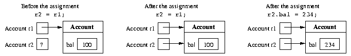

```java
int c1, c2;
c1 = 100;
c2 = c1;
c2 = 234;
System.out.println(c1); // prints 100
```

primitive type의 변수에 값을 저장

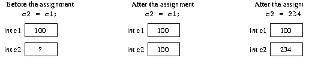

이러한 두 방식의 변수의 값을 저장하는 차이로 인하여 메서드(Method) 단위에서 값을 수정할 때, 방식이 달라진다.
primitive type의 경우에는 Actual parameter에 변수의 값을 복사하여 매개변수를 저장한다.
객체 type의 경우에는 변수의 저장된 객체의 메모리 주소값을 Actual parameter의 값으로 전달한다.

### 숫자 타입의 primitive types

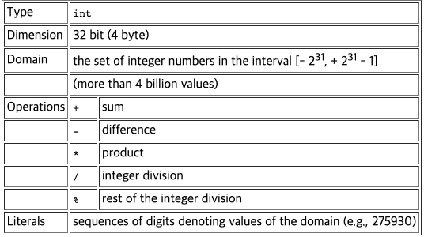
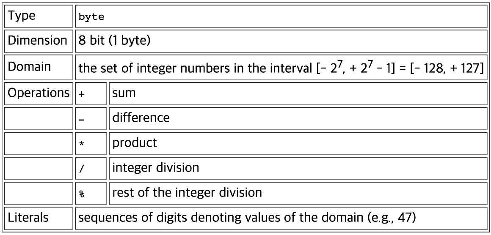
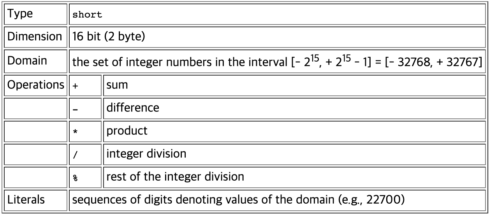
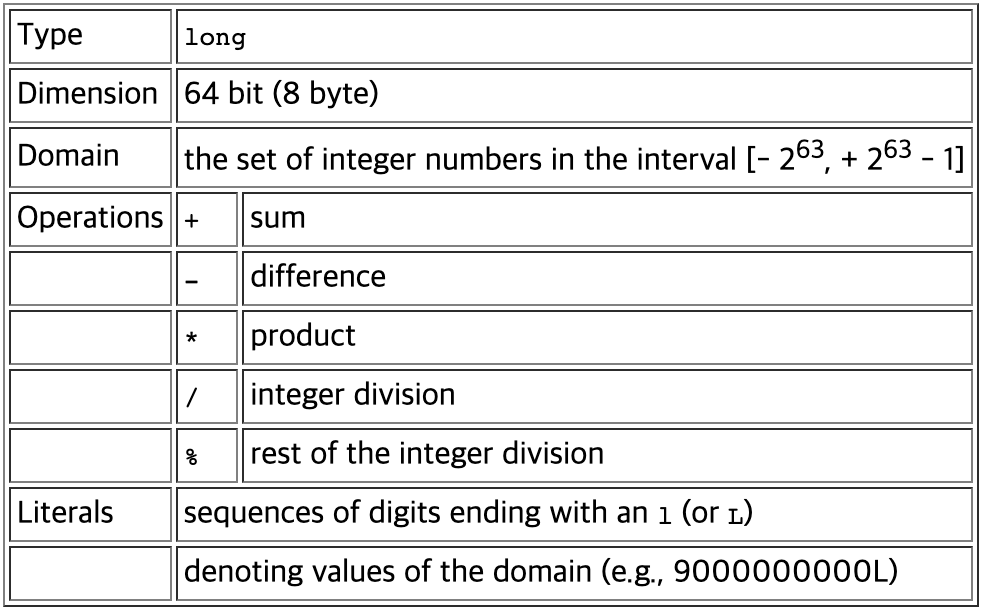
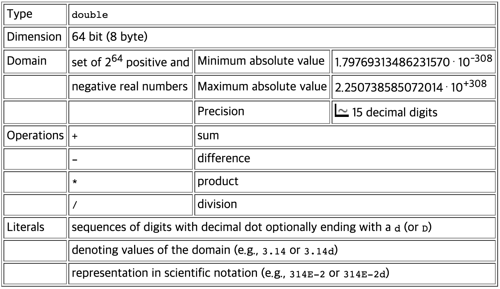
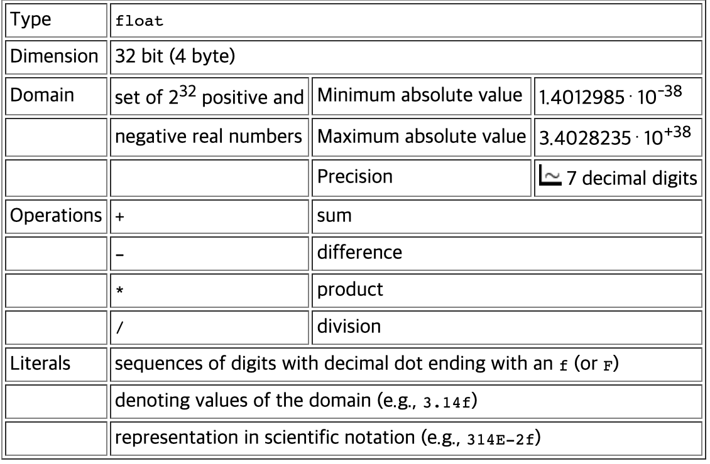

### 문자 정보를 처리하기 위한 Data types

- char 유형의 변수에는 단일 문자만 포함될 수 있습니다.
- char 유형의 도메인은 유니코드 표준의 64000개 이상의 문자로 구성됩니다.
- char 유형의 리터럴은 다양한 방법으로 표시될 수 있습니다. 가장 간단한 방법은 작은따옴표를 사용하는 것입니다.

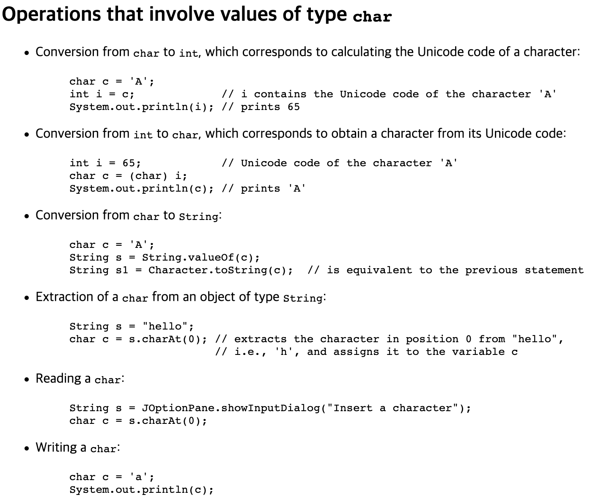

### boolean Data types

- 진리값을 나타내는 표현식(예: 값이 true 또는 false 일 수 있는 표현식 ) 을 처리할 수 있는 원시 데이터 유형


- 이러한 연산을 boolean algebra이라고 한다.

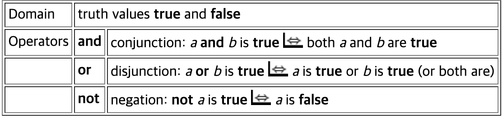
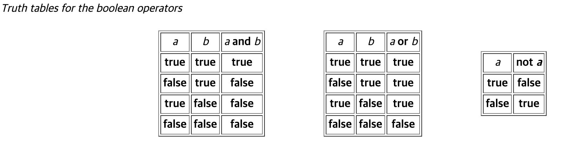

- boolean 타입의 연산자
  1. && (And)
  2. || (Or)
  3. ! (Invert, Not)

## Wrapper Class

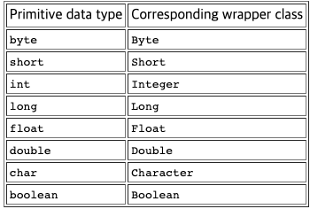

- Java는 primitive type에 대한 Wrapper class를 사전에 정의하였다.
- primitive type과 이름이 동일(유사?)하지만 대문자로 시작한다.
- primitive type의 값을 객체로 사용할 수 있게 포장?해주는 역할을 수행한다.

## 오버플로우 (Numeric overflow)

- Pt로 표현될 수 있는 값 집합은 표현할 수 있는 값의 한계가 존재한다. 주어진 Data type의 값에 산술연산을 적용할 시, 해당 한게를 벗어나는 경우를 `Overflow`라고 합니다.
- `int` 단위의 값에 오버플로우가 발생하면 해당 Data type에서 표현할 수 있는 가장 작은 값이 됩니다.
- 비공식적으로 값의 표현이 순환하는 것과 같습니다.

- `double`, `long`의 경우에서 오버플로우가 발생하면? 어떠한 일이 발생할까?

## Combined assignment operators

- 각각의 사칙연산 및 나머지 연산에 대하여 `+=, -=, *=, /=, %=` 이런식의 표현이 가능합니다.

```java
int a = 3;
a = a + 1; // a += 1과 동일합니다.
a = a - 1; // a -= 1과 동일합니다.
a = a * 1; // a *= 1과 동일합니다.
a = a / 1; // a /= 1과 동일합니다.
a = a % 1; // a %= 1과 동일합니다.

```

## 증감 연산자 (Increment and decrement operators)

- 변수의 값을 1씩 증가 혹은 감소 시키기 위해서 사용되는 연산자
- 배열의 인덱스, 반복문에서 증감 연산자가 변수의 앞 혹은 뒤에 붙는지에 따라서 적용의 순서가 달라짐.
  - 연산자가 변수의 앞에 존재 (전위 수식), 변수의 값을 증감 시킨 후 할당
  - 연산자가 변수의 뒤에 존재 (후위 수식), 변수의 값을 할당한 후 증감

## Expression VS Statement (Expression with Side-Effect)

- Expression: 값(Value)를 표현하는 수식/코드
  - 각 타입의 Literals도 코드 자체에 표현된 값을 의미하는 것이므로 Expression에 속한다고 볼 수 있다.
- Statement: CPU 혹은 JVM이 동작하게끔 하는 명령어의 집합
  - Statement가 Expression을 포함하고 있다고 생각 (Statement + Expression = Statement)

## Magic Number

- 어떠한 설명이나 암시적인 힌트? 없이 코드에 그대로 적용되는 숫자 Literals 이다.
- 상수를 정의하여 사용하거나, 주석을 사용하여 해당 Literal에 대한 설명을 보충해 주어 가독성과 프로그램의 수정 가능성을 향상 시킬 수 있다.

_그렇다면 실수나 문자인 경우에는 Magic Character이나 Double/Float이 되는 건가?_

## 표현 정밀도의 한계: 반올림 오류/오차

- Java에서 두 실수(Floating Point)를 계산할 때, 계산/연산에 참여하지 않는 값들로 인하여 정확한 값이 산출되지 않는다.
- 특히 반올림의 경우에는 아예 버려지는 값도 존재하기에 더 심하다고 볼 수 있다.
- 이러한 계산에서 계산의 정밀도를 향상시키기위해 사용하는 클래스 타입이 `BigDecimal`이다. 해당 클래스의 메서드를 이용하여 정밀한 계산을 할 수 있다.

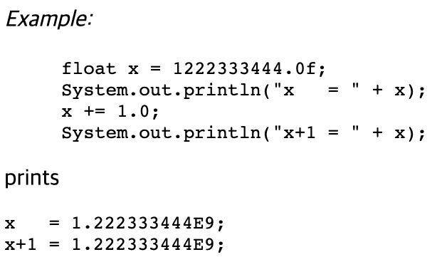

## 표현 정밀도의 한계: 산술 평균, 기하 평균의 불일치

## Java에서 서로 다른 primitive type들 간의 연산

- Java에서 서로 다른 primitive type의 연산을 실시할 때, 그 결과의 타입을 정의하는 기준이 존재한다.
  1. `int`타입 이하의 값들은 `int`로 변환되어 계산되고 `int`타입의 결과로 반환된다.
  2. `int`타입보다 큰 타입들은 두 타입의 크기를 비교한 다음, 더 큰 타입의 결과를 반환한다.
  3. 정수 타입 보다 실수 타입을 더 우선시 한다.
  4. 두 타입의 크기가 동일하다면, 정수 타입 보다는 실수 타입의 결과를 반환한다.

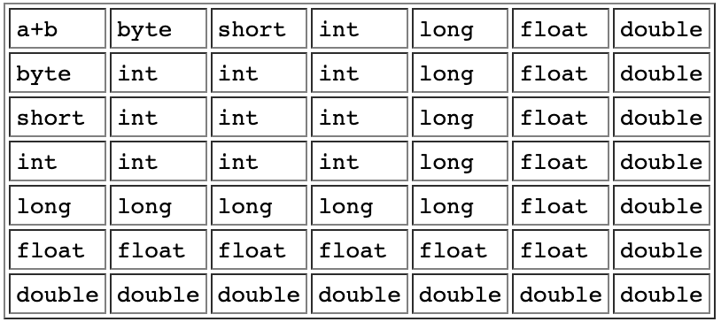

## 다양한 primitive 타입 간 할당문제

- 일반적으로 더 작은 타입의 변수에 크기가 큰 타입의 값을 넣는다면 값의 일부를 버려야 하므로, 더 큰 자료형의 변수에 할당하는 것을 추천한다.
- 디음의 표를 참고하여 서로 다른 primitive 타입 변수 간 할당이 적합한지 알 수 있다.

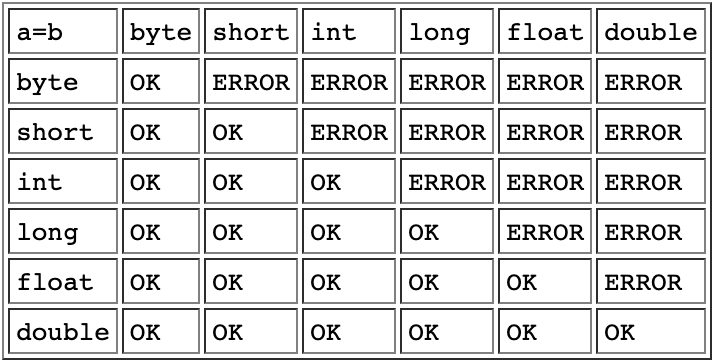

- 굳이 더 작은 자료형의 변수에 값을 넣고 싶거나 명시적으로 타입 변환을 표햔하고 싶은 경우 Casting을 사용하여 명시적으로 타입을 변결 할 수 있다.

```java
double d; float f; long l; int i; short s; byte b;

// The following assignments are correct
d = f;   f = l;   l = i;   i = s;   s = b;

// The following assignments are NOT correct
f = d;   l = f;   i = l;   s = i;   b = s;

// The following assignments are correct,
// but the result could be affected by a loss of precision
f = (float)d;   l = (long)f;   i = (int)l;   s = (short)i;   b = (byte)s;
```

## 비교 연산자 (Comparison operators)

- Primitive type 변수 값을 비교하여 `boolean` 값을 반환하는 식(Expression)을 구성합니다.

```java
==	equal to   (Attention: = is different from == )
!=	different from
>	greater than
<	less than
>=	greater than or equal to
<=	less than or equal to
```

## 실수를 비교하는 방법 (Comparing floating point numbers)

- 반올림의 오류로 실수를 비교할 때, 예상하지 못한 결과가 발생할 수 있다.
- 따라서 다음의 방법을 고려해 볼 수 있을 것!
  1. 단순하게 `==`연산자로 비교할 수 없다.
  2. 두 수의 값의 차를 절대적인 오차(eps, 10^-14) 값 보다 작다면 이를 0으로 생각할 수 있고, 두 수는 같다라고 판별할 수 있을 것입니다.
  3. 두 수가 너무 크거나 작다면, 해당 수식이 eps 보다 작거나 같다는 비교 식으로 값을 비교할 수 있습니다.
  - |x - y| / max(|x|, |y|) <= eps
  - 단, 두 수의 값 중 1개가 0일 경우에는 최댓값으로 나누는 방법을 고려해서는 안됩니다.

## Predicates

- 반환 타입이 boolean 타입인 함수를 Predicates이라고 부릅니다.

## 서로 다른 연산자의 우선순위 (Precedence between operators of different types)

- 다양한 타입의 연산자가 등장하는 복잡한 식을 평가해야 할 경우에는 우선 순위를 고려해야 합니다.
  1. 논리적 부정 연산자(!) - 높은 우선순위
  2. 산술 연산자
  3. 관계 연산자 (비교 연산자?)
  4. 논리적 연산자 (&&. ||) - 낮은 우선순위
