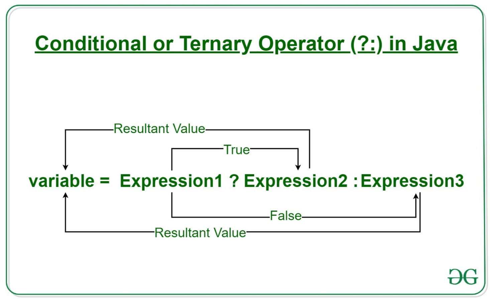

# Conditional statements

## Summary

- The if-else and if statements
- Block of statements
- Conditional expression
- Comparison between objects
- The switch statement

## Statements in Java

- Java에서 사용하는 구문/명령문(Statement)
- JVM이 어떠한 동작을 수행하도록 하는 키워드 및 표현식의 조합

_문제를 해결해야 할 때 특정 조건이 참인지 거짓인지에 따라 다양한 작업을 수행하는 데 관심이 있는 경우가 많습니다 ._

## Block of Statements

- 한 줄의 Statement 만으로 동작을 표현할 수 있는 상황이 존재하지만, 다 수의 줄의 Statements를 통해서 동작을 지정할 수 있을 것이다. 이러한 경우에는 Statement Block으로 묶어서 묶인 구문/명령문들이 그룹화 되어있음을 표현할 수 있다.

```java
{
  statement
  ...
  statement
}
```

## Scope of variables defined in a block

- Block 안에서도 지역 변수를 선언 및 정의할 수 있다. 그러나 Block 안에서 선언/정의된 변수를 Block의 밖에서는 사용이 불가능하다.
- 메서드/함수 내부에서도 지역 변수를 선언할 수 있으나 메서드/함수 밖에서는 사용할 수 없고 Call Stack에서 나가게 되면 그 값이 소멸된다.

```java
public class ScopeInBlock {

  public static void main(String[] args) {
    String a = "Hello";
    int i = 1;
    {
      System.out.println(a);
           // OK. a is visible - prints Hello
      //int i;
           // ERROR. i is visibile and cannot be redeclared

      {
        double r = 5.5;          // OK
        i = i + 1;               // OK. i is still visible
        System.out.println(r);   // OK. r is visible - prints 5.5
      }

      //System.out.println(r); // ERROR. r is not visible
      System.out.println(i);   // OK. i is visibile - prints 2

      {
        int r = 4;       // OK. previous r is not visible anymore
        System.out.println(a);
                         // OK. a is still visibile - prints Hello
      }
    }

   i = i + 1;                  // OK. i is visible
   System.out.println(i);      // OK. i is visible - prints 3

  }
}
```

## Conditional statements

- 다른 일번적인 고급 프로그래밍 언어와 마찬가지로 Java 또한 특정한 조건이 참 혹은 거짓인지에 따라 코드의 특정한 부분을 실행하는 특정한 구문/명령문이 존재한다.

- 일반적으로 2개 이하의 대안/조건을 가지는 상황에서는 `if-else`문을 사용한다.
- 3개 이상의 대안/조건을 가지는 상황에서는 `switch-case`문을 사용한다.

## Condition in an if-else statement

- `if-else`구문에서 if에 들어가는 조건은 boolean 타입의 표현식을 주로(90%) 사용한다.

다음은 일반적으로 많이/주로 사용되는 표현식의 유형이다.

```java
1. boolean 변수;
boolean finished;
if (finished)

2. 비교 연산자 (==, !=, >, <, >=, or <=)
int a, b, c;
if (a > b + c)

3. predicate 호출
String answer;
if (answer.equalsIgnoreCase("YES"))

4. ! , && 및 ||
int a, b, c, d;
String answer;
if ((a > (b+c)) || (a == d) && !answer.equalsIgnoreCase("YES"))
```

## 중첩 if 문 (Nested if)

- `if-else`문의 각 분기에서 또 다른 구문이 사용될 수 있다. 이러한 경우나 상황을 중첩 되었다고 한다.
- `if-else` 중첩된 문을 이라고 부른다.

```java
int day, month, year, nextDay, nextMonth, nextYear;
...
if (month == 12) {
  if (day == 31) {
    nextDay = 1;
    nextMonth = 1;
    nextYear = year + 1;
  } else {
    nextDay = Day + 1;
    nextMonth = month;
    nextYear = year;
  }
} else {
  ...
}
```

- Nested if문은 주로 각 조건이 상호배제적인 상태일 때 주로 사용됩니다. (주어진 두 조건이 동시에 참이 될 수 없는 부분에 주로 사용됨.)

```java
int temp;
...
if (30 < temp)
  System.out.println("hot");
else if (20 < temp)
  System.out.println("warm");
else if (10 < temp)
  System.out.println("fine");
else
  System.out.println("cold");
```

- 일반적으로 복잡한 조건식(condition/Expression)을 사용하는 `if-else` 문을 의미를 이해하기 편하게 작성할 수도 있습니다.

```java
if ((x < y) && (y < z))
  System.out.println("y는 x와 z 사이에 있습니다.");
else if
  System.out.println("y는 x와 z 사이에 없습니다.");
```

```java
if (x < y)
  if (y < z)
    System.out.println("y는 x와 z 사이에 있습니다.");
	else if
    System.out.println("y는 x와 z 사이에 없습니다.");
else if
  System.out.println("y는 x와 z 사이에 없습니다.");
```

## Ternary Operator

- Java에서 조건식을 1개의 표현식(Expression)으로 나타낼 수 있는 방법이다.
- 조건식을 사용하는 경우에 따라서 `if-else`구문을 단순화 할 수 있다.



## 두 문자열을 비교 (Equality Between Strings), 사전순으로 문자열을 정렬/비교

- 두 문자열의 값이 일치하는지 확인하려면 `eqauls()`메서드를 사용하여 두 값을 비교할 수 있다.
- 두 문자열의 값의 크기를 비교하려면 `compareTo()`메서드를 사용하여 두 값의 차이로 크기가 큰지 작은지 알 수 있다.

_문자열 뿐만아니라 다른 객체 타입의 값을 비교할 때도 `eqauls()`메서드를 사용하여 값의 일치를 비교할 수 있다._

## null 값을 비교

- 어떠한 객체도 참조하지 않는 유형의 변수의 기본 값은 null이란 것을 기억해 본다면 조건문에서 null과의 비교를 시행할 수 있다.
- null을 비교하기 위해서는 주소 값을 비교해야 하기에, 값을 비교하는 `equals()`메서드는 사용하지 않는다.

## The switch statement

- 3개 이상의 조건 중, 여러개의 항목을 선택하고자 할 때, 중첩된 if문 대신에 `switch-case`문을 사용할 수 있다.

```java
switch (expression) {
  case label-1: statements-1
                 break;
  ...
  case label-n: statements-n
                 break;
  default: default-statements
}
```

- switch에 들어갈 수 있는 표현식은 상수의 표현식이어야 한다. 상수의 표현식이므로 당연히 Compile time에 지정되어야한다.
- 표현식에 들어갈 수 있는 값은 정수 혹은 문자가 들어갈 수 있다.
  - Java 11 버전을 사용하는 현재에는 문자열도 실수도 해당 Expression에 들어갈 수 있다.
