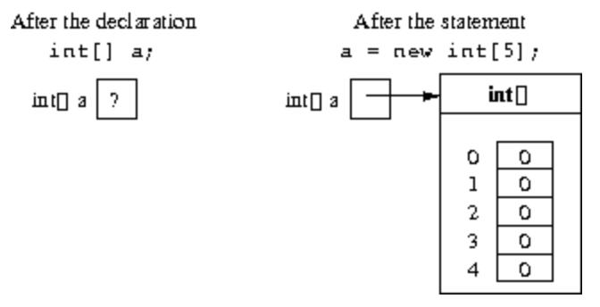
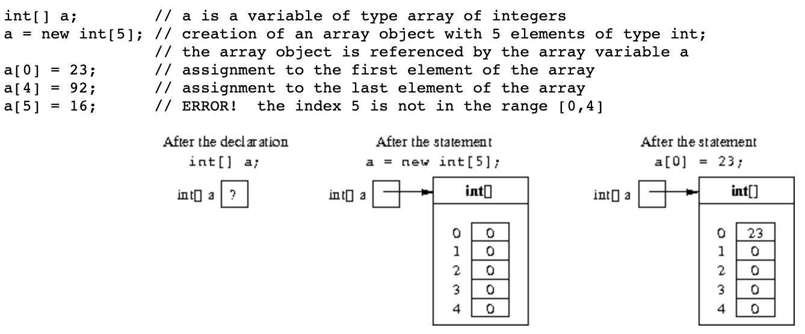
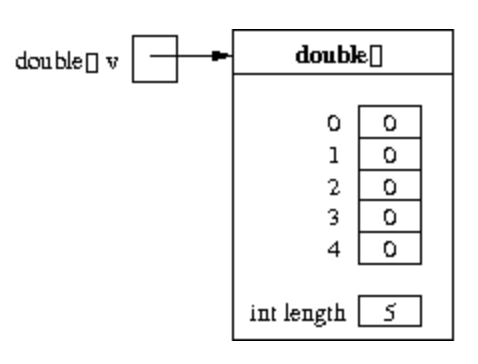
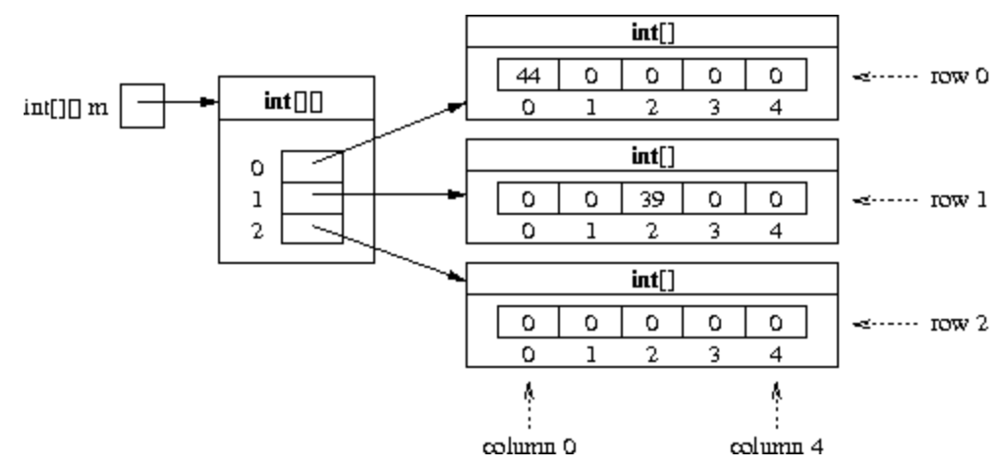

# Arrays and matrices

## Summary

- Arrays as collections of elements
- Declaration of array variables
- Creation of array objects
- Access to the elements of an array object
- Expressions that represent array objects
- Parameters passed to a program
- Matrices (as arrays of arrays)

## Array

- Array는 동일한 Data type의 요소(Data)를 연속적으로 저장할 수 있는 객체/타입이다.
- 각 요소는 인덱스(Index)로 접근이 가능하다.

  - 인덱스(Index): 배열에 저장된 요소의 순서를 숫자로 표현한 것
  - 배열의 인덱스는 0번 부터 시작하고 (data의 개수 - 1)에서 끝난다. 총 data의 개수는 동일하다.
  - 배열의 실제 크기(Size)는 Array에 저장 될 Data type의 크기와 그 data의 개수로 계산이 가능하다.

- Java에서 Array를 사용하는 방법

  1. 배열 타입의 변수를 선언한다.
  2. 변수에 저장 할 요소의 수(size, dimension)를 지정하여 배열 객체를 구성한다.
  3. 변수에 값을 넣거나 배열 객체의 요소에 인덱스로 접근한다. (배열의 인덱스를 사용하여 단일 변수처럼 접근이 가능하다.)

### 배열의 선언 (Declaration of array variables)

```java
type[] arrayName;
```

- type은 배열에 들어갈 Data의 Data type을 의미한다.
- arrayName은 선언 혹은 정의할 배열 객체의 식별자 역할을 한다.

_배열(Array)를 정의만 하였고 아직 Dimension을 지정해주지 않았고, 각 요소에 값(Data)를 초기화하지 않았으므로 사용할 수는 없다. 다만, 앞의 과정을 다 마치면 배열에 접근할 수 있다._

### 배열 객체 생성 (Creation of an array object)

```java
type[] arrayName = new type[dimension];
```

- 우리가 배열을 사용하기 위해서는 먼저 배열에 저장할 값(Data)의 개수(dimension, size)를 먼저 지정해 주어야합니다.
- dimension은 0 이상의 정수이며, Java 에서는 int의 값으로 표현된다.



### 단일 요소에 대한 접근 (Access to the single elements of an array)

```java
arrayName[index];
```

- 배열의 인덱스로 해당 순서에 저장된 값에 접근하여 수정, 할당 등의 동작을 수행한다.
- arrayName 배열에 N개의 요소(Dimension이 N)가 있는 경우, 인덱스의 표현 범위는 [0, N-1]이다.
  - 위의 범위를 준수하지 않는다면, `ArrayIndexOutOfBoundsException`이 발생한다.



### 배열의 차원을 저장하는 Instance Variable(IV)

- 각 배열에는 요소들을 저장하는 공간 외에도 차원(Dimension)을 저장하는 static 변수가 존재한다.
- 개발자가 임의로 수정할 수 없다.
- 개발자는 이 변수에 접근하여 배열의 Dimension을 알 수 있다.

```java
double[] v;
v = new double[5];
System.out.println(v.length); // prints 5
```



### 배열 객체를 나타내는 표현식 (Expressions that denote array objects)

- Java에서는 배열의 객체를 String과 같이 표현이 가능하다.
  - {expression1, expression2, ... , expressionk} 이런 식으로 표현이 가능하다.
  - String과 같은 Immutable Object임.

```java
    int[] v = {4 ,6 , 3, 1};
```

```java
    int[] v = new int[4];
    v[0] = 4; v[1]= 6; v[2] = 3; v[3] = 1;
```

_String 리터럴은 객체를 표현하기 위해서 Body 어디에서나 사용할 수 있었지만, 배열을 나타내는 표현식은 배열이 초기화 될때만 사용이 가능하다. 초기화 될 때, 표현식을 사용하면 자동으로 배열의 차원(Dimentsion)을 맞춰준다._

## 행렬 (Matrices)

- 동일한 Data type의 요소를 모아 테이블 형식으로 구현한 형태
- Java에서는 배열의 배열로 표현될 수 있으며, 행렬의 요소는 각 배열이라고 볼 수 있다.

행렬의 선언 및 정의는 아래와 같은 방법을 따른다.

```java
int[][] m;   // declaration of an array of arrays (matrix) m

// creation of an array object of 3 elements,
// each of which will contain the reference to a row of the matrix
m = new int[3][];

m[0] = new int[5];  // creation of row 0 of the matrix (5 columns)
m[1] = new int[5];  // creation of row 1 of the matrix (5 columns)
m[2] = new int[5];  // creation of row 2 of the matrix (5 columns)
```

한번에 행렬을 생성할 수도 있음.

```java
// creation of an array object of 3 elements,
// each of which is an array of 5 integers (3x5 matrix)
m = new int [3][5];
```

- 행렬의 요소에 대한 접근

- 행렬의 단일 요소 또한 인덱스를 이용하여 접근할 수 있다.
- 행렬의 인덱스도 배열과 마찬가지로 N개의 차원에 [0, N - 1]의 범위를 가지고 있다.
- 배열과의 차이점은 첫 번째 인덱스는 몇 번째 배열에 접근하는 지를 의미하고
- 두 번째 인덱스는 해당 배열에서 몇 번째 위치해 있는 요소인지 알 수 있는 인덱스 이다.

```java
// assignment of a value to the element of m in row 1, column 2
m[1][2] = 39;

// assignment of a value to the element of m in row 0, column 0
m[0][0] = 44;

// access to the element of m in row 1, column 2
System.out.println(m[1][2]);   // prints out 39
```



### 행렬의 표현식

- 행렬은 단순하게 요소를 배열로 가지고있는 특수한 상태의 배열로 생각할 수 있다. 따라서 배열의 표현식 안에 배열을 넣는 것으로 표현할 수 있다.

```java
int[][] m = { { 3, 5  },
              { 1, -2 }
            };
```

```java
int[][] m = new int[2][2];

m[0][0] = 3;
m[0][1] = 5;
m[1][0] = 1;
m[1][1] = -2;
```

### 행령의 행과 열 수(Dimension of rows and columns of a matrix)

```java
double[][] v;
v = new double[15][20];
System.out.println(v.length);    // prints out 15
System.out.println(v[0].length); // prints out 20
```

- m.length는 행렬 m 의 행 수(row)를 나타냅니다.
- m[i].length는 행렬 m 의 i 행에 있는 열 수(col)를 나타냅니다.
