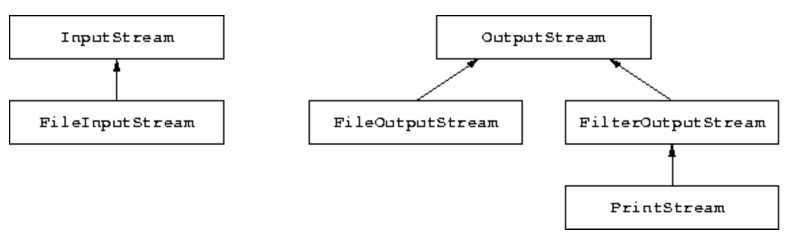
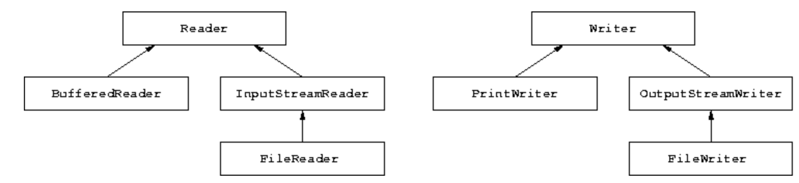

# Files and input/output streams

## Summary

- The concept of file
- Writing and reading text files
- Operations on files
- Input streams: keyboard, file, internet
- Output streams: file, video
- Generalized writing and reading through streams

## The concept of file

- 파일(File)은 대용량 저장 장치에 data를 영구적으로 저장하는 메커니즘 입니다.

  - 영구적(Pernament)이라는 말은 전원이 꺼져도 data가 손실되지 않는 것을 보장하는 것 입니다.

- File의 종류
  1. Binary File: 컴퓨터(JVM)는 쉽게 해석할 수 있지만, 사람은 해석하기 어려운 형식의 Data
  2. Text File (표준 형식): 사람이 일반적으로 읽을 수 있는 형식의 Data를 저장한다.

_여기에서는 Text File만 다룬다._

- 각 파일은 파일의 이름과 각 파일이 저장되는(위치하고 있는) 장소를 표현하는 디렉토리로 구분됩니다.
  - SSD, HDD 등의 디스크에서 파일을 찾을 수 있는 것은 전체 경로를 파일의 주소로 간주하기 때문이다.

## Operations on files

- Java에서 파일에 대한 읽기 및 쓰기 작업을 수행하기 전에 파일을 열어야 하고 파일 작업을 모두 마쳤으면 파일을 닫아야 합니다.

- Opening
  - 파일을 연다는 것은 Java App내에서 파일을 조작하고 싶다는 것을 운영체제에 알리는 것이며, 운영체제는 이러한 기능이 가능한지 가늠합니다.
- Closing
  - 파일을 닫는다는 것은 App에서 파일이 더는 사용되지 않는다는 것을 의미하며, 운영체제에게 더 이상 파일을 사용하지 않는다고 말하는 것 입니다. 파일을 닫으면 파일에 기록된 데이터가 디스크로 효과적으로 전송되도록 하는 효과도 존재합니다.

## Writing text files

- File에 Text를 작성하려면 다음의 과정을 수행/이행 해야합니다.
  1. 파일의 이름을 매개변수로하는 `FileWriter` 클래스의 객체를 생성하고 파일을 Opening 합니다.
  2. `FileWriter` 객체와 연관되어있는 `PrintWriter` 객체를 생성합니다.
  3. `PrintWriter` 객체의 `print()`, `println()`메서드를 사용하여 파일에 Text를 기록합니다.
  4. 파일을 닫아, data가 효과적으로 디스크에 저장될 수 있도록 합니다.

```java
// 1. opening the file for writing (creation of the file)
FileWriter f = new FileWriter("test.txt");
PrintWriter out = new PrintWriter(f);

// 2. writing text on the file
out.println("some text to write to the file");

// 3. closing the output channel and the file
out.close();
f.close();
```

_`FileWriter`을 통해서 파일에 접근할 경우, 기존에 data가 존재하는 파일의 경우에는 이전의 data가 소멸하므로 사용에 유의할 것!_

_이전의 내용을 지우지 않고, 이어서 쓰는 경우에는 `FileWriter(String, boolean)`객체를 선언하여 사용하는 것이 바람직하다._

```java
import java.io.*;

public class WritingOnFile {
  public static void main(String[] args) throws IOException {
    // opening the file for writing
    FileWriter f = new FileWriter("test.txt");
    // creation of the object for writing
    PrintWriter out = new PrintWriter(f);

    // writing text on the file
    out.println("some text written on a file");

    // closing the output channel and the file
    out.close();
    f.close();
  }
}
```

## Loop schema for writing to a file

일반적으로 파일에 사용자 입력의 데이터를 기록 할 때, 해당 방식을 주로 사용한다.

```java
PrintWriter out = ...
while (condition) {
   out.println(data);
   ...
}
out.close();
```

_여기에서 종료 조건(condition)은 파일에 작성하는 데이터에 따라서 변할 수 있습니다._

## Reading from a text file

- 파일에서 데이터를 읽어서 App에 읽어오려면 다음의 과정을 수행/이행 해야합니다.
  1. `FileReader`클래스의 객체를 생성한다.
  2. `FileReader`와 관련된 `BufferedReader`클래스의 객체를 생성하여 파일을 엽니다.
  3. 객체의 메서드 혹은 다른 방법들❇︎을 사용하여 Text를 읽습니다.
  4. 파일의 읽기가 종료되면 파일을 닫습니다.

```java
// 1. opening the file for reading
FileReader f = new FileReader("test.txt");;
BufferedReader in = new BufferedReader(f);

// 2. reading a line of text from the file
String line = in.readLine();

// 3. closing the file
f.close();
```

```java
import java.io.*;

public class ReadingFromFile {
  public static void main(String[] args) throws IOException {
    // opening the file for reading
    FileReader f = new FileReader("test.txt");
    // creation of the object for reading
    BufferedReader in = new BufferedReader(f);

    // reading a line of text from the file
    String line = in.readLine();
    System.out.println(line);

    // closing the file
    f.close();
  }
}
```

## Loop schema for reading from a file (다른 방법들)

앞서 파일을 읽는 방법으로 제시된 방법

```java
BufferedReader in = ...
String line = in.readLine();
while (line != null) {
   process line
   line = in.readLine();
}
```

- 문자 1개씩 읽는 방법

  - 위 방법은 파일에 존재하는 문자의 개수를 Counting 할 때 사용한다.
  - I/O에서 상당한 자원을 소모하기 때문에 이러한 방법은 좋지 않다.

```java
BufferedReader in = ...
int c = in.read();
while (c != -1) {
   process c
    c = in.read();
}
```

```java
BufferedReader in = ...
int c = 0;
while ((c = in.read()) != -1) {
   process c
}
```

- 지정된 크기 만큼 읽는 방법
  - 파일에 저장된 data를 버퍼에 지정된 크기만큼 읽어온다.
  - 작업의 횟수가 획기적으로 줄어들어 권장되는 방법이다.

```java
BufferedInputStream in = ...
int read = 0;
byte[] buffer = new byte[1024]; // 1KB의 버퍼를 생성, 1KB 크기씩 파일을 읽음.
// 보통 BufferedInputStream의 가능한 최대크기를 버퍼의 크기(Dimension)으로 차용하여 사용한다.
// in.available()

while((read = in.read(buffer) != -1)) {
    stream에 존재하는 파일 정보를 활용
}
```

_파일을 읽고 쓰는 것은(I/O) 상당한 시간과 자원을 소모하므로 프로그래머는 이러한 반복의 횟수를 최소화하는 것이 좋다._

## Renaming and deleting a file in Java

파일을 삭제하려면, `File`객체에 대하여 `delete()`메서드를 호출하여 제거할 수 있다.

```java
File f1 = new File("garbage.txt");
boolean b = f1.delete();
// if b is true, then the file has been deleted successfully
```

파일의 이름을 변경하려면, 이름을 바꿀 파일과 변경할 이름을 가지고 있는 파일 객체를 생성하여 `renameTo()`메서드를 실행한다.

```java
File f1 = new File("oldname.txt");
File f2 = new File("newname.txt");
boolean b = f1.renameTo(f2);
// if b is true, then the file has been renamed successfully
```

- 변경하려는 이름의 파일이 존재하는 경우, 해당 파일을 덮어 씁니다.

_`File` 객체는 생성될 때, Exception을 발생시키지 않습니다. 따라서 `delete()`, `renameTo()`메서드를 실행시킬 때, 예외가 발생됩니다._

## Input/output streams

- Java에서 모든 I/O장치, 모든 Sequence의 생산자/소비자로서 처리하는 일반적인 방법을 정의합니다.

- Input 장치의 대표적인 예

  - Keyboard
  - File
  - Internet Resource

<br>

- Output 장치의 대표적인 예

  - Video
  - File



## `InputStream`

```java
// Keyboard
InputStream is = System.in;

// File
FileInputStream is = new FileInputStream("data.txt");

// Internet
URL u = new URL("http://www.inf.unibz.it/");
InputStream is = u.openStream();
```

## `OutputStream`

```java
// Video → 비디오가 아니라 사용자 콘솔인거 같음.
OutputStream os = System.out;

// File
FileOutputStream os = new FileOutputStream("data.txt");
```

## Reading from an input stream and writing to an output stream

```java
// Example 1: reading from an input stream
InputStream is = ...; // keyboard, file or Internet
InputStreamReader isr = new InputStreamReader(is);
BufferedReader br = new BufferedReader(isr);
String line = br.readLine();

// Example 2: writing to an output stream (1)
OutputStream os = ...; // video or file
PrintWriter pw = new PrintWriter(os);
pw.println("Hello");

// Example 3: writing to an output stream (2)
OutputStream os = ...; // video or file
PrintStream ps = new PrintStream(os);
ps.println("Hello");
```


