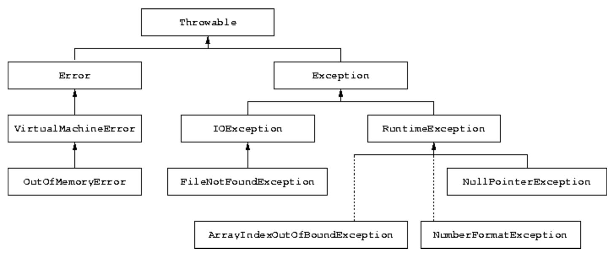

# Program errors and exception handling

## Summary

- Types of program errors
- Syntax, semantic, and logical errors
- Compile time and runtime errors
- Test drivers
- Debugging techniques
- Exception handling
- The most common types of exceptions
- The throws clause and the throw statement
- Catching exceptions by means of the try-catch construct
- Propagation of exceptions
- Exceptions when reading from a file

## Types of program errors

- 오류의 유형

  1. Syntax Error: 프로그래머의 코드가 Java의 문법의 규칙을 충족 시키지 않았을 때, 발생하는 오류이다.
  2. Semantic Error: Statement를 적절히 사용하지 않아서 발생하는 오류이다.
     - Java의 문법은 충족하지만, 그 안의 값이 적절히 적용되지 않은 경우에 많이 발생한다
     - `NullPointerException`이 대표적인 오류라고 볼 수 있다.
  3. Logical Error: 프로그래머가 예상하는 결과와 실제 프로그램의 실행 결과가 일치하지 않는 경우를 뜻하는 오류이다.

- 오류가 감지되는 시간으로 오류를 2가지로 분류할 수 있다.
  - Compile time errors: 코드를 컴파일 할때, 검출되는 Syntax errors와 Static semantic errors 이다.
  - Runtime(Execution time) errors: 컴파일 할때, 검출되지 않고 App을 실행 시켜야 확인할 수 있는 오류이다.

## Syntax errors

- Java의 Statement 규칙을 준수하지 않아서 발생하는 오류

```java
// Example 1: Missing semicolon:
int a = 5 // semicolon is missing
Compiler message:

/*
*  Example.java:20: ';' expected
*  int a = 5
*/

// Example 2: Errors in expressions:
x = ( 3 + 5;  // missing closing parenthesis ')'
y = 3 + * 5;   // missing argument between '+' and '*'
```

## Semantic errors

- Java 구문의 규칙을 준수하나, 구문에 사용되는 표현식(Expression) 혹은 변수(값)에 문제가 발생하는 경우를 의미한다.
- `Null`이나 타입 관련 오류 등이 주로 여기 오류에 속하는 듯 하다.

```java
//Example 1: Use of a non-initialized variable:
int i;
i++;    // the variable i is not initialized

//Example 2: Type incompatibility:
int a = "hello"; // the types String and int are not compatible

//Example 3: Errors in expressions:
String s = "...";
int a = 5 - s;  // the - operator does not support arguments of type String

//Example 4: Unknown references:
Strin x;                     // Strin is not defined
system.out.println("hello"); // system is not defined
String s;
s.println();        // println is not a method of the class String


//Example 5: Array index out of range (dynamic semantic error)
int[] v = new int[10];
v[10] = 100;           // 10 is not a legal index for an array of 10 elements
```

_Array에서 10개의 요소를 선언 하였으나 실제 인덱스의 범위는 [0, 9(N-1)]이므로 10번 째 인덱스에 접근하는 것은 컴파일러에 감지되지 않지만, 프로그램을 실행시키면 Semantic 오류가 발생한다._

## Logical errors

- App이 오류없이 실행되지만, 프로그래머가 예상한 결과와 실제 App의 실행결과가 다른경우에 발생하는 오류이다.

```java
// Example 1: Errors in the performed computation:
public static int sum(int a, int b) {
  return a - b ;
}
// this method returns the wrong value wrt the specification that requires
// to sum two integers

// Example 2: Non termination:
String s = br.readLine();
while (s != null) {
  System.out.println(s);
}   // this loop does not terminate
```

## Drivers for testing

- 클래스나 메서드의 정확성(신뢰성, 오류가 발생하는 경우에도 잘 동작하는 지)를 시험하는데 사용되는 프로그램 부분이다.
- 각 인터페이스에 대한 모든 부분을 호출하고 해당 메서드가 사양을 준수하는지 확인하는 것이다.

- 완전한 테스트를 위한 지침
  1. 각 기능(메서드)의 동작을 확인한다.
  2. 특정한 순서에 따라서 테스트를 진행한다.
  3. 각 Statement가 적어도 한 번씩 실행될 수 있도록 테스트를 실시한다.
  4. 예외 처리를 감지하는 부분을 작성하고 테스트를 실시합니다.

## Techniques for detecting errors (debugging)

- 테스트 단계에서 Runtime Errors의 원잉을 감지할 수 없는 경우에 사용됨.
- 흔하게 Debugging이라는 말로 쓰인다.

- Debugging을 수행하는 2가지의 방법
  1. 코드에 출력문을 삽입하여, 특정한 표현식의 값이나 코드의 동작을 확인하는 방법
  2. Debugger를 통해서 App을 실행하므로써 특정한 표현식의 값이나 코드의 동작을 확인하는 방법

### Debugging by inserting output statements

```java
int a, b, x;
a = 5;
b = Integer.parseInt(kb.readLine()); // reading of b
...         // statements that do not change b
x = a/b;
```

`b`값을 화면에 출력하여, 변수 `b`에 어떠한 값이 초기화 되었을때, 오류가 발생하는지 알 수 있음.

_기본 데이터 타입이 아닌 객체의 내용을 탐색해야하는 경우에 객체 내용에 대한 정보를 제공하는 `toString()`메서드를 사용하는 것을 권고함. 메서드 Overriding을 통해서 출력문의 커스텀 또한 가능하다._

### Execution of the program by means of a debugger

- Debugger를 사용하는 일련의 과정 (IDE나 Editor마다 다르지만, 일반적인 경우)
  1. 코드 한 줄씩 Statement를 실행한다.
  2. 프로그래머가 중단점(Breaking Point)을 지정하여, 그 중단점 까지 프로그램을 자동으로 실행한다.
  3. Debugging 도중에 언제든지 변수와 객체의 내용을 확인할 수 있다.

```java
int a, b, x;
a = 5;
b = Integer.parseInt(kb.readLine()); // reading of b
...         // statements that do not change b
x = a/b;
```

```java
String s, t;
s = null;
...
t = s.concat("a");
```

`t`에 대한 할당은 `NullPointerException`예외를 발생시킨다. 프로그램이 실행될 떄, `t`에 할당된 `s`의 메모리 주소나 값에 따라서 달라질 수 있다. 해당 오류를 확인하여면, 오류를 생성하는 `s`의 값을 확인 하면된다.

## Handling errors during the execution of programs

- App 실행 도중, 비정상적으로 종료되는 경우가 발생 할 수 있음.
- Java에서는 Runtime 시 발생하는 오류를 예외(Exception)라는 말로 부른다.
- 프로그램에 예기치 않게 종료되는 것을 방지하기 위해서 프로그래머가 적절한 예외처리를 할 수 있어야한다.

### The hierarchy of exceptions



점선은 간접적인 Typing 관계를 나타냅니다.

## How to handle exceptions

- 예외를 처리하는 방법은 2가지가 존재한다.
  1. 생성된 예외를 처리하는 것
  2. 프로그램의 다른 지점에서 예외를 처리하는 것

_예외가 처리되지 않는다면, App이 종료되고 Console에 예외에 관한 메시지가 출력됩니다._

## The `throws` clause

- Java의 모든 메서드는 `throws`절을 사용하여 호출되는 메서드에 의해서 생성된 예외를 처리할 수 있습니다.
  - 처리한다는 느낌 보다는 생성된 예외의 처리를 맡긴다?(이양한다?)로 보는 것이 맞는 것 같다.

```java
public static void main(String[] args) throws IOException {
  ...
}
```

## Checked exceptions and runtime exceptions

- Java에서 예외는 2가지로 분류된다.

  1. `Checked Exception`
  2. `Runtime Exception`(Unchecked Exception)

- Checked Exception

  - 일반 `Exception` 타입을 Sub Typing 했다면 해당 클래스는 `Checked Exception`타입이다.

- Runtime Exception(Unchecked Exception)

  - `Runtime Exception` 타입을 Sub Typing 했다면 해당 클래스는 `Runtime Exception`타입이다.

_모든 `Exception`를 타이핑한 클래스는 예외처리를 하지 않는다면은 `throws` 명령어를 사용해야 하지만 `Runtime Exception`클래스는 `throws`명령어를 사용하지 않아도 된다._

## Definition of new exceptions

사용자 정의의 예외를 정의하고 싶다면, `Exception`클래스와 그 하위 타입을 사용하여 정의할 수 있다.

```java
public class MyException extends Exception {
  public MyException (String message) {
    super(message);
  }
}
```

예외가 발생할 때 인쇄되는 문자열을 매개변수로 넘겨줍니다.

## How to catch an exception

- `throws` 구문에서 예외를 발생시켜 다른 메서드나 객체로 전달하면, 누군가는 그 예외를 처리해야한다. 그럴 경우에 사용하는 것이 `Try-Catch`문이다.
- 예외가 발생하면 프로그램이 종료되는 대신에, `catch()`의 body에 존재하는 구문(Statement)을 실행한다.

```java
try {
  try-block
}
catch(ExceptionClass1 e) {
  catch-block
}
catch(ExceptionClass2 e) {
  catch-block
}
...
finally {
  finally-block
}
```

- try-block: 다음 catch 절의 제어 하에 실행될 일련의 명령문이 작성되는 공간
- catch-block: try-block의 명령문이 해당 catch절에 지정된 타입의 예외를 생성하는 경우에 실행될 명령문들이 작성되는 공간
- finally-block: catch-block에 관계없이 항상 실행되는 명령문이 작성되는 공간

```java
try {
   System.out.println(Integer.parseInt(br.readLine());
}
catch(IOException e1) {
   System.out.println("An IO error occurred.");
}
catch(NumberFormatException e2) {
   System.out.println("The string read does not contain an integer.");
}
finally {
   System.out.println("Block executed.");
}
```

`getMessage()`메서드를 사용하여, 예외(Exception) 타입을 생성할 때, 작성한 문자열을 가져올 수 있다.

```java
try {
  ...
}
catch (NumberFormatException e) {
  System.out.println("Catched NumberFormatException");
  System.out.println(e.getMessage());
}
catch (IOException e) {
  System.out.println("Catched IOException");
  System.out.println(e.getMessage());
}
```

### Example

```java
import java.io.*;

public class MaximumWithoutExceptions {
  public static void main (String args[]) throws IOException {
    BufferedReader br = new BufferedReader(new FileReader("data.txt"));
            // could generate FileNotFoundException (checked)
    int max = -1;

    String line = br.readLine();
            // could generate IOException (checked)
    while (line != null) {
      int n = Integer.parseInt(line);
          // could generate NumberFormatException (unchecked)
      if (n > max) max = n;
      line = br.readLine();
          // could generate IOException (checked)
    }
    System.out.println("Maximum = " + max);
  }
}
```

## Propagation of exceptions

- 예외가 발생한 곳에서 구문으로 예외를 처리하지 않는다면 예외가 발생한 메서드를 호출한 메서드로 예외 처리에대한 의무?, 책임?이 전달된다.
- 이러한 전파는 예외를 처리할 때까지 아니면 예외가 처리되지 못하고 오류 메시지를 전달 할 때까지 지속됩니다.

```java
import java.io.*;

public class ExceptionPropagation1 {

  public static void main(String[] args) throws Exception {
    BufferedReader br = new BufferedReader(new InputStreamReader(System.in));
    System.out.println("Insert a number:");
    int c = Integer.parseInt(br.readLine());
    first(c);
  }

  private static void first(int a) throws Exception {
    second(a);
  }

  private static void second(int b) throws Exception {
    Exception propagate = new Exception("The value is too small.");
    if (b < 10)
      throw propagate;
    System.out.println("OK");
  }
}
```

중간에서 예외를 처리하여, 예외를 처리해야할 필요가 없는 부분은 `throws`문을 사용할 필요가 없다. <br>
main() 메서드에서는 `BufferedReader`와 `InputStreamReader`를 사용하기 때문에 추가적인 예외를 처리한 것으로 보인다.

```java
import java.io.*;

public class ExceptionPropagation2 {

  public static void main(String[] args) throws IOException {
    BufferedReader br = new BufferedReader(new InputStreamReader(System.in));
    System.out.println("Insert a number:");
    int c = Integer.parseInt(br.readLine());
    first(c);
  }

  private static void first(int a) {
    try {
      second(a);
    }
    catch (Exception e) {
      System.out.println("Exception handled in the first method.");
      System.out.println(e.getMessage());
    }
  }

  private static void second(int b) throws Exception {
    Exception propagate = new Exception("The value is too small.");
    if (b < 10)
      throw propagate;
    System.out.println("OK");
  }
}
```

## Example of exception handling when reading from a file

```java
public static void printIntegers(String filename) {
  try {  // cattura exceptions di IO
    FileReader f = new FileReader(filename);
    BufferedReader in = new BufferedReader(f);
    String line = in.readLine();
    while (line != null) {
      try { // capture NumberFormaException
        int n = Integer.parseInt(line);
        System.out.println(n);
      }
      catch(NumberFormatException e) {
        System.out.println("***");
      }
      line = in.readLine();
   }
  }
  catch (IOException e) {
    System.out.println(e.getMessage());
  }
}
```

_finally 구문이 존재에 예외가 발생할 수 있다면은, try-catch 구문이 존재하여도 무조건적으로 실행되는 finally 때문에 throw구문을 사용해야한다._
