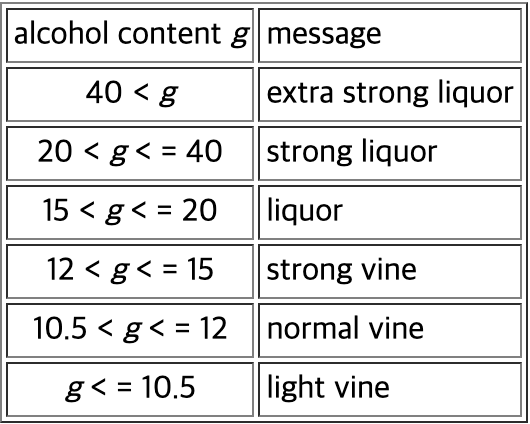

= Exercises

* Exercise 05.1
** Write a program that reads a real number and prints a message according to the following table:

---

* Exercise 05.2
** Write a program that reads from input the lengths of the three sides of a triangle and determines the type of the triangle according to the following algorithm:

[source]
----
compare each pair of sides and count home many pairs are equal
if (the number of equal pairs is 0)
  it is irregular
else if (the number of equal pairs is 1)
  it is symmetric
else
  it is regular
----

---

* Exercise 05.3
** Write a program that reads from input the lengths of the three sides of a triangle and determines the type of the triangle by using if-else statements with complex conditions.

---

* Exercise 05.4 
** Realize a Java class to represent triangles, on which the following functionalities are defined:
*** creation of a triangle, given the lenghts of the three sides; 
*** return of the length of the longest side, the intermediate side, and the shortest side; 
*** test whether the three sides can actually be the sides of a triangle; + 
i.e., they respect the triangular inequality, which states that the longest side is shorter than the sum of the other two;
*** return of the perimeter of the triangle; 
*** return of the area of the triangle; notice that, given the lengths a, b, and c of the three sides of a triangle, `s = (a + b + c)/2` is the semiperimeter;
*** return of a string representing the type of the triangle, which may be either regular,  symmetric, or irregular.
** Write also a program to test all functionalities of the class representing triangles.

---

* Exercise 05.5 
** Write a program that reads from input the coefficients a, b, c of the quadratic equation `a * x^2 + b * x + c = 0` and computes the zeroes of the equation.
** Depending on the sign of the discriminant `b^2 - 4 * a * c`, the program should print the two distinct real solutions, the real double solution, or the two complex solutions.

---

* Exercise 05.6
** Write a program that reads from input a line of text containing a YES/NO question (without final question mark) and prints an answer to the question according to the following rules:
*** if the line starts with a vocal, the answer is "MAYBE".
*** if the last letter of the line is "a", "i", or "u", the answer is "YES";
*** if the last letter of the line is "e" or "o", the answer is "NO";
*** if the last letter of the line is a character different from "a", "e", "i", "o", "u", the answer is "DON'T KNOW";
* Note: 
** When two rules can be applied, the answer is obtained by concatenating the answers for the two rules.

---

* Exercise 05.7 
** Realize a Java class to represent dates, on which the following functionalities are defined:
*** creation of a date, given day, month, and year;
*** return of day, month, and year;
*** test whether two dates are equal;
*** test whether a date precedes another date;
*** test whether the year of a date is a leap year;
*** compute the date of the next day.
*** Write also a program to test all functionalities of the class representing dates.
