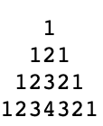

= Exercises

* Exercise 06.1
** Write a program that reads 10 (arbitrary) integers and prints the smallest one.

---

* Exercise 06.2
** Write a public static method that takes as parameter a positive integer `n`, and prints the first `n` even numbers.

---

* Exercise 06.3
** Write a public static method that takes as parameter a positive integer `n`, and computes and returns the factorial of `n`. The method should also print a suitable message when `n` is negative.

---

* Exercise 06.4
** Write a program that reads from input an integer `n` and a sequence of integers of length `n`, and prints the sum of the positive and the sum of the negative integers in the sequence.

---

* Exercise 06.5
** The value of `PI` can be calculated with the series
** Write a public static method that takes as parameter an integer `n`, and computes and returns the value of `PI` approximated to the first `n` terms of the series.

[source]
----
PI = 4 - 4/3 + 4/5 - 4/7 + 4/9 - 4/11 + ...
----

---

* Exercise 06.6 
** Write a public static method that takes as parameters a string and an integer `d`, and returns the string suitably decoded according to `d`. 
** The decoded string is obtained by replacing each character `c` in the string with the character that has code equal to the code of `c` decremented by `d`.

---

* Exercise 06.7 
** Write a public static method that takes as parameters a string and a character `c`, and returns the position of the first character of the longest sequence of consecutive `c` is in the string. If `c` does not occur at all in the string, the method should return `-1`.

---

* Exercise 06.8
** Modify the program for printing the multiplication table in such a way that the printed numbers are aligned in columns.

---

* Exercise 06.9 
** Write a public static method that takes and parameter an integer `h` between 1 and 9, and prints a pyramid of numbers of height `h`.

* Example: 
** For `h` = 4 the method should print the pyramid

---

* Exercise 06.10 
** Write a program that reads from input and integer `n` and prints the factorial of all numbers between `1` and `n`. 
** Make use of the method defined in Exercise 6.3.

---

* Exercise 06.11 
** A positive integer is said to be prime if it is divisible only by `1` and by itself. 
** Write a public static method that takes as parameter a positive integer, and returns a boolean that indicates whether the integer is prime or not.

---

* Exercise 06.12
** Write a program that reads from input an integer `n`, and prints all prime numbers between `2` and `n`. 
** Make use of the method defined in Exercise 6.11.

---

* Exercise 06.13 
** Write a program that reads from input an integer `n`, and prints the first `n` prime numbers (by convention, `1` is not considered to be prime).
** Make use of the method defined in Exercise 6.11.

---

* Exercise 06.14 
** Write a program that reads from input an integer `n`, and prints all its prime factors. 
** For example, if the integer is `220`, the program should print: `2, 2, 5, 11`. 
** Make use of the method defined in Exercise 6.11.

---

* Exercise 06.15 
** Realize a Java class to represent messages. Each message is characterized by:
*** a sender,
*** a receiver,
*** the text of the message.

** All three types of information should be represented as strings. Besides the functionalities of getting and setting the sender, the receiver, and the text, messages should support the operation of swapping the sender and the receiver, and three forms of compression:
*** elimination of the white spaces at the beginning and at the end of the text, and replacement of each sequence of more than one whitespace (used to separate words) with a single white space;
*** elimination of all vowels;
*** both (1) and (2).